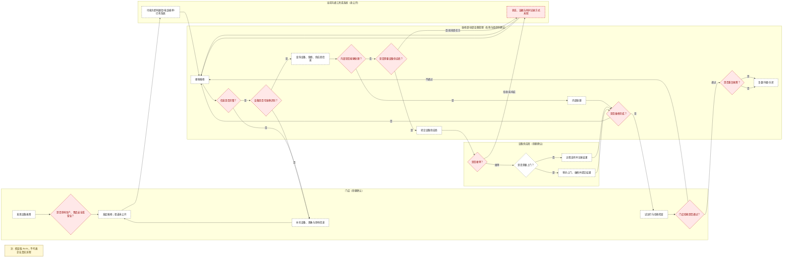
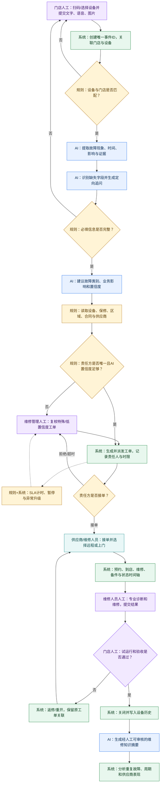

# 野人先生设备维修协同现状 Deep Research 与 As-Is / To-Be 流程研究报告

> 研究截止日期：2026-07-19  
> 报告性质：公开资料 Deep Research + 流程假设与企业验证方案  
> 重要声明：本报告不把公开资料无法证明的内部流程写成野人先生事实。所有结论统一使用【已确认事实】【合理推断】【行业参照】【待企业验证】四类标签。

## 0. 执行摘要

本次研究最重要的结论不是“野人先生缺少一个报修系统”，而是：

1. 【已确认事实】野人先生的核心产品是门店终端现制的 Gelato。公开采访进一步说明，其生产链是“中央工厂预处理冷冻奶浆—冷链配送—门店缓化、加入食材并使用专用设备极速凝冻”的协同模式，门店承担不可省略的最终制作环节。[来源3][来源4][来源5]
2. 【已确认事实】专用制作设备并非普通后勤设施，而是品牌现制模式、产品口感和连锁复制的基础。品牌官方及创始人采访均披露自研、联合研发或国产化设备；创始人明确把设备国产化称为 Gelato 连锁化的前提。[来源3][来源4][来源6]
3. 【已确认事实】截至 2026 年 3—4 月，可交叉核验的公开口径为在营门店超过 1300 家；媒体数据库口径在 2026 年 4 月 28 日为 1372 家。品牌 2024 年开始加盟，此前门店为直营；当前直营/加盟比例未公开。[来源7][来源9][来源11][来源12]
4. 【已确认事实】野人先生已公开选择飞书作为“千店数智中枢”，开店、知识、品控稽查、一店一群等流程已有数字化基础；其中品控流程已出现“问题上报—自动派单—超时升级—分析报表”的相邻闭环。[来源10]
5. 【已确认事实】赛事题目明确了门店、维修部、设备供应商三方和“实时同步、缩短故障处置周期”的目标，但公开资料没有披露真实报修渠道、工单系统、维修部组织归属、派单规则、供应商接单方式、SLA、备件、费用、验收或关闭责任。[来源1][来源2]
6. 因此，本报告中的 As-Is 只能命名为《As-Is 现状流程假设版 v0.1》。【待企业验证】微信/电话报修、信息不完整、反复追问、无台账、无 SLA、无工单系统、供应商状态不可见等均不得作为企业事实。
7. 【合理推断】在“门店现制 + 专用设备 + 千店加盟扩张”条件下，设备停机会影响当店可售口味、出品节奏、产品温控与品牌承诺；但影响程度、频率和损失必须用真实故障案例与时间戳验证。
8. To-Be 的正确方向是：以唯一工单和设备主数据为骨架，以确定性规则控制保修、供应商、区域和 SLA，以 AI 处理文字/语音/图片等非结构化信息，以人工承担安全、专业诊断、特殊路由和验收责任。当前不应直接写成企业正式解决方案。

**首版 PoC 范围建议**

- 【已确认事实支持】优先验证“门店专用 Gelato 制作/极速凝冻设备”和“低温储存或密闭温控售卖设备”两类，因为它们与门店终端制作、现制口感和温控直接相关。[来源3][来源5][来源6]
- 【基于流程验证需要的行业参照】可加入一类普通设施设备作为对照，检验同一流程能否处理不同业务关键性；具体选择空调、水电或收银设备必须由真实案例决定，不能预设。
- 【待企业验证】首版最终设备清单、设备唯一编号、供应商和保修绑定、故障分级、安全停机规则、验收标准。

## 1. 研究目标与边界

### 1.1 研究目标

本报告依次回答：

1. 野人先生为什么高度依赖门店设备；
2. 哪些设备有公开证据、哪些只是行业推断；
3. 赛事确认了哪些角色和目标；
4. 在内部资料缺失时，如何构建不冒充事实的 As-Is 假设；
5. 潜在等待发生在哪里、需要采集哪些时间戳；
6. To-Be 应由哪些已确认约束和待验证瓶颈推导；
7. AI、规则、系统和人工分别承担什么；
8. 进入正式产品设计前必须获得哪些企业证据。

### 1.2 不在本阶段完成的内容

- 不搭建飞书多维表格；
- 不输出完整 PRD；
- 不承诺 ROI 或效率提升比例；
- 不推断真实供应商、设备型号、SLA 和组织名称；
- 不以模拟数据代替企业运营数据；
- 不提供拆机、接电、制冷剂或其他高风险维修指导；
- 不把飞书通用解决方案描述为野人先生已经上线的维修系统。

## 2. 研究方法与证据分级

### 2.1 方法

研究采用“本地材料审计—企业直接资料—创始人/高管采访—协会与监管资料—高质量媒体—行业产品与流程参照”的顺序。关键结论至少追溯到一个直接来源；存在冲突时保留冲突，不用多数投票制造确定性。

### 2.2 统一证据标签

| 标签 | 定义 | 使用规则 |
|---|---|---|
| 【已确认事实】 | 企业官方、赛事原文、监管/协会、创始人或高管直接采访支持 | 只陈述来源明确支持的范围 |
| 【合理推断】 | 由已确认业务事实推导，但没有内部流程直接证据 | 必须写清推导链和验证方法 |
| 【行业参照】 | 来自相似连锁门店、设备运维、FSM/CMMS/EAM 或设备厂商 | 只用于流程设计和提问，不证明企业现状 |
| 【待企业验证】 | 公开资料不能回答 | 必须通过访谈、日志、台账、合同或真实案例确认 |

### 2.3 本地材料质量审计

| 材料 | 可用内容 | 发现的问题 | 本报告处理 |
|---|---|---|---|
| 课题选择综合分析报告 | 赛事方向、团队此前产品假设 | 大量流程与痛点未给企业证据 | 仅作背景，不作事实 |
| 第一阶段饱和式方案 | 功能、字段、PoC 和测试思路 | 把电话/微信、信息不完整、无沉淀等行业假设写得过于确定 | 全部降级为待验证 |
| 三人分工方案 | 交付协同方式 | 预设空调、冷柜、收银机和演示 SLA | 不作为设备范围和 SLA 证据 |
| 两份企业概览 | 赛事企业索引 | 一份把野人先生写成户外鞋履零售，明显错误 | 不采用企业描述 |
| 企业浅度研究概览表 | 提供了待核验线索 | 把野人先生写成 2021 年广州现制酸奶品牌，明显错误 | 不采用；作为材料幻觉警示 |

结论：本地材料对“研究问题和方案假设”有价值，但不能提供野人先生内部维修事实。

### 2.4 关键来源冲突处理

| 冲突 | 来源表现 | 处理 |
|---|---|---|
| “全部门店现做”与中央工厂奶浆 | 新华网以品牌叙事描述门店全程现制；界面新闻对创始人的直接追问说明中央工厂先做冷冻奶浆，门店完成缓化、配料与极速凝冻 | 采用更具体的“中央预处理 + 冷链 + 门店终制”；把前者理解为强调终端制作，不解释为所有原料均从零开始 |
| 门店数量 | 2025 年 8 月约 900；2025 年 9 月接近/突破 1000；2026 年 3 月超过 1300；媒体数据库 2026 年 4 月为 1372 | 所有数字带日期，不混为一个“当前值”；报告主口径取可交叉核验的“超过 1300 家” |
| 设备成本降幅 | 不同采访出现进口 60 万/国产 6 万、成本为 1/5 或 1/4 | 只确认“显著国产化降本且更适配门店”；具体比例不用于 ROI |
| 官网“专利设备” | 官方网站称设备获国家专利，但未列出专利号 | 可确认官方主张，专利清单仍需企业提供或向国家知识产权数据库逐项核验 |

## 3. 野人先生业务模式与门店生产特征

### 3.1 结论先行

野人先生不是把工业成品冰淇淋运到门店直接销售，而是把门店作为终端制作节点。中央工厂、冷链和门店设备共同构成生产系统；因此门店设备故障可能是生产中断事件，而不只是后勤设施报修。

| 研究问题 | 结论 | 结论类型 | 证据来源 | 对维修协同的启示 |
|---|---|---|---|---|
| 核心商业模式 | Gelato 现制冰淇淋连锁，强调天然食材、门店现做、分时售卖 | 【已确认事实】 | [来源3][来源4][来源7] | 工单应能描述对当店生产和售卖节奏的影响 |
| 门店采用何种现制模式 | 中央工厂将巴氏杀菌鲜奶制成冷冻奶浆并冷链配送；门店缓化、加入食材并用专用机器极速凝冻 | 【已确认事实】 | [来源5] | 设备、物料批次、温控和门店要能关联 |
| 中央工厂负责什么 | 至少负责鲜奶预处理和冷冻奶浆 | 【已确认事实】 | [来源5] | 门店故障可能需要判断是否影响在途/在库物料 |
| 门店负责什么 | 缓化解冻、加入水果/坚果等、专用机凝冻、终端出品；公开报道还观察到出锅时间展示 | 【已确认事实】 | [来源5] | 门店员工是故障发现和复工验收的重要输入方 |
| 门店是否承担关键制作环节 | 是；最终凝冻和部分新鲜食材处理在门店进行 | 【已确认事实】 | [来源4][来源5] | 核心设备停机可能直接影响可售产品 |
| 设备对口感和品质的作用 | 品牌称设备用于奶浆融合、低温烹饪、密闭储藏；创始人强调温度波动影响冰晶与口感 | 【已确认事实】 | [来源3][来源8] | 维修验收不能只看“通电”，还需业务试运行与品质/温控确认 |
| 是否存在自研/联合研发设备 | 官方称自研专利设备；创始人称与国内供应商联合研发并实现国产化 | 【已确认事实】 | [来源3][来源4][来源6] | 供应商可能掌握专用知识和配件，但真实售后边界未知 |
| 国产化为何影响连锁 | 创始人明确称设备国产化是 Gelato 连锁化前提，并称早期设备存在 bug 时不敢开放加盟 | 【已确认事实】 | [来源6] | 设备稳定性与加盟扩张存在直接业务联系 |
| 当前规模 | 截至 2026 年 3—4 月超过 1300 家；2026 年 4 月媒体数据库口径 1372 家 | 【已确认事实】/【行业参照】 | [来源7][来源9][来源12][来源22] | 多区域、多店、多供应商协同复杂度显著上升 |
| 直营/加盟 | 2024 年才开始加盟，之前为直营；当前比例未公开 | 【已确认事实】/【待企业验证】 | [来源6][来源11] | 费用、资产所有权、维修授权与验收可能按店型分叉 |
| 企业标准是否涉及设备 | 2026 年发布的企业标准草案覆盖原料、工艺、设备配置和终端售卖机制 | 【已确认事实】 | [来源7][来源8] | 设备标准条款应成为故障分类和验收规则来源 |

**为什么维修协同具有业务价值**

【合理推断】设备维修协同的价值来自四条已经确认的业务约束：

1. 门店是生产节点，不只是销售节点；
2. 核心设备为专用、联合研发或国产化设备；
3. 品牌承诺包含当日现做、分时售卖和温控品质；
4. 千店规模且含加盟体系，使设备、门店、保修和供应商映射更复杂。

这四点能够说明“值得研究维修协同”，但不能证明当前一定存在信息缺失、推诿或无 SLA。

## 4. 门店核心设备与供应商关系研究

### 4.1 设备类别

| 设备类别 | 公开证据 | 可能承担的业务功能 | 故障可能造成的影响 | 是否适合进入首版 PoC | 仍需确认的问题 |
|---|---|---|---|---|---|
| 核心制作设备：专用 Gelato/极速凝冻设备 | 创始人说明门店用专用冰淇淋机完成极速凝冻；多次采访谈国产化设备 | 将奶浆与食材转化为终端 Gelato | 【合理推断】对应口味无法生产、生产排程受阻；是否全店停产取决于设备冗余 | 是，优先级最高 | 数量、型号、冗余、故障码、供应商、保修、清洗复位 |
| 核心制作设备：品牌所称自研融合/低温烹饪装置 | 官网明确披露 | 奶浆结构处理、食材融合或低温工艺 | 【合理推断】影响批次质量或产能 | 是否位于门店未知，暂不直接纳入 | 位于中央工厂还是门店、具体资产清单、专利号 |
| 低温储存/密闭售卖设备 | 官网披露立式储藏仓；采访和现场报道提到密闭桶、开放/温控售卖柜和冷冻奶浆 | 保存奶浆或成品、控制温度、隔绝空气和光 | 【合理推断】温控失守、产品品质风险、报废或停售 | 是，作为第二类核心设备 | 温度阈值、报警方式、复工与食品放行标准 |
| 冷链配送与门店收货设备 | 中央工厂冷冻奶浆经冷链配送 | 保持原料温度与批次可追溯 | 【合理推断】可能影响多个门店/批次 | 不建议作为门店 PoC 首对象，可保留接口 | 物流方、温度记录、责任转移点、异常批次处置 |
| 原料处理/辅助制作设备 | 报道确认门店削水果、焖米饭、加入坚果等；具体设备未披露 | 新鲜食材处理、配料、缓化与称量 | 【合理推断】影响部分口味或效率 | 真实案例出现后再选 | 设备种类、是否标准配置、关键性、清洗要求 |
| 收银与数字化设备 | 现场有出锅时间大屏；POS/打印机等未见野人先生直接披露 | 售卖、订单、生产节奏展示 | 【合理推断】可能影响交易或信息展示 | 作为对照项，需企业确认 | POS 架构、离线能力、IT 支持边界 |
| 空调、水电和普通设施 | 创始人称 Gelato 门店对水电条件要求高；具体设施维修未披露 | 提供制作环境、公用工程和顾客环境 | 【合理推断】部分故障可能影响营业或安全 | 仅在真实案例证明高频/高影响后加入 | 资产归属、商场物业边界、报修责任 |

### 4.2 供应商关系

- 【已确认事实】创始人公开表示，目前有两个设备供应商陪伴品牌成长，品牌作为需求方参与上游研发迭代。[来源6]
- 【已确认事实】赛事命题明确“设备供应商”为三方之一。[来源2]
- 【待企业验证】两个供应商是否对应全部门店设备、是否直接承担售后、是否按区域配置服务商、是否有授权维修商、供应商能否直接接收门店工单。
- 【待企业验证】设备所有权、保修责任、加盟商费用承担和总部采购管理边界。

### 4.3 首版 PoC 设备范围

**有公开证据支持的选择**

1. 专用 Gelato 制作/极速凝冻设备；
2. 低温储存、密闭储藏或售卖温控设备。

**基于流程验证需要的对照选择**

选择一类不直接参与 Gelato 制作但可能影响营业的设施设备，用于检验紧急度和责任路由是否能区分“生产关键设备”与“普通设施”。候选设备不能预先锁定，需从企业真实案例中选择。

**仍需企业确认**

- 单店有几台核心设备、是否可以降级运行；
- 哪类设备故障最多、哪类最影响营业；
- 设备二维码/唯一编号是否存在；
- 核心设备、低温设备、POS、水电和物业设施分别由谁维修；
- 哪些故障要求停机、隔离物料或食品安全复核。

## 5. 门店规模、加盟模式与协同复杂度

| 已确认业务事实 | 可能增加的协同复杂度 | 结论类型 | 验证数据 |
|---|---|---|---|
| 超过 1300 家门店，跨多城市经营 | 服务半径、区域供应商覆盖、备件前置和升级层级增加 | 【合理推断】 | 门店—供应商覆盖表、区域响应数据 |
| 2024 年起开放加盟，此前直营 | 资产所有权、费用、授权和验收可能因直营/加盟分叉 | 【合理推断】 | 门店类型、合同、费用规则 |
| “超级加盟商”多店经营 | 同一加盟商可能拥有集中运维能力，也可能增加总部—加盟商—门店层级 | 【合理推断】 | 加盟商门店数、内部运维组织 |
| 专用设备由品牌与供应商长期迭代 | 故障诊断可能依赖专门知识、配件和版本信息 | 【合理推断】 | 型号、版本、知识库、配件清单 |
| 飞书已是千店数智中枢 | 维修流程存在复用现有身份、店群、知识和派单能力的基础 | 【合理推断】 | 飞书现有应用、权限、接口和数据边界 |

不应得出的结论：公开资料不能证明当前扩张已经导致维修混乱，也不能证明直营店或加盟店维修效率更低。

## 6. 维修协同角色地图

| 角色 | 是否被命题或公开资料确认 | 可能职责 | 可能接收的信息 | 可能输出的信息 | 需要企业确认的问题 |
|---|---|---|---|---|---|
| 门店员工 | 命题确认“门店”，具体岗位未知 | 发现异常、初始上报、补充现场证据、执行安全隔离 | 设备信息、补充要求、处理状态 | 现象、图片/视频、业务影响、试运行结果 | 谁可报修、是否允许停机、是否可验收 |
| 门店店长 | 品控闭环公开确认店长接整改单；维修职责未知 | 【合理推断】确认营业影响、协调进店、验收 | 工单、预约、升级 | 影响确认、验收/拒绝 | 店长是否为维修工单责任人 |
| 加盟商 | 加盟结构已确认 | 【合理推断】承担资产/费用/服务商协调 | 多店工单、费用、供应商表现 | 审批、升级、资源协调 | 是否有自有运维、能否自选供应商 |
| 区域运营 | 品控超时升级公开确认区域层；维修职责未知 | 【合理推断】重大影响升级、跨店协调 | 超时、重大故障 | 升级决策、临时运营方案 | 是否进入所有工单还是仅异常 |
| “维修部”或总部设备管理 | 赛事命题确认“维修部”，组织实体未知 | 接收、判断、内部处理、供应商路由、关闭治理 | 报修、台账、保修、历史 | 路由、任务、升级、关闭 | 所属层级、正式名称、权限、值班机制 |
| 内部 IT | 未被公开确认 | 【合理推断】处理数字化设备/系统问题 | POS/网络/终端异常 | 诊断、恢复、转派 | 是否存在、与设备维修如何分界 |
| 设备供应商 | 赛事与创始人采访确认 | 设备技术支持、备件或售后（售后职责待确认） | 设备、故障、保修、地址 | 接单、方案、预约、结果 | 是否直接接单、能否更新状态、服务范围 |
| 区域售后服务商 | 未确认 | 【行业参照】承接区域上门服务 | 派工、设备和门店信息 | 接单、到店、备件、结果 | 是否存在、与原厂关系 |
| 上门维修工程师 | 未确认 | 【行业参照】现场诊断与维修 | 工单、手册、历史、备件 | 到店、诊断、用件、维修结论 | 身份、资质、操作权限 |
| 财务/费用审核 | 未确认 | 【行业参照】保外维修和非标费用审批 | 报价、合同、工单 | 审批/拒绝 | 何种金额和情形触发 |
| 采购/设备管理 | 设备研发和标准已确认，具体岗位未知 | 【合理推断】供应商/合同/设备标准管理 | 设备表现、费用、故障趋势 | 采购与更新决策 | 是否与维修部同一团队 |

### 6.1 五个关键未知

1. “维修部”是总部职能、区域团队、外包服务台，还是上述主体的组合：**未知**。
2. 门店能否直接联系供应商：**未知**。
3. 供应商是否由总部按设备/区域/合同统一绑定：**未知**。
4. 谁决定内部维修还是供应商维修：**未知**。
5. 谁拥有升级、验收后最终关闭和重开工单的责任：**未知**。

## 7. 已确认事实、合理推断与待验证假设

| 编号 | 判断 | 类型 | 说明 |
|---|---|---|---|
| F1 | 野人先生是 2011 年起步的 Gelato 现制冰淇淋品牌 | 【已确认事实】 | 官网与多次创始人采访交叉支持 |
| F2 | 门店完成最终缓化、配料和专用机凝冻 | 【已确认事实】 | 创始人对界面新闻直接说明 |
| F3 | 品牌存在自研、联合研发或国产化设备 | 【已确认事实】 | 官网、新华网、36氪采访支持 |
| F4 | 设备国产化是品牌开放加盟和连锁化的重要前提 | 【已确认事实】 | 创始人直接表述 |
| F5 | 2026 年 3 月在营门店超过 1300 家 | 【已确认事实】 | 协会/媒体品牌发布信息交叉支持 |
| F6 | 2024 年开始加盟，此前为直营 | 【已确认事实】 | 创始人访谈 |
| F7 | 飞书已用于开店、知识、品控稽查和一店一群等运营场景 | 【已确认事实】 | 联合创始人公开分享 |
| F8 | 赛事要求打通门店、维修部、设备供应商数据链路 | 【已确认事实】 | 团队获取的赛题材料 |
| I1 | 核心制作设备故障可能立即减少门店可售产品 | 【合理推断】 | 由门店终制和专用设备依赖推导 |
| I2 | 低温设备故障可能触发品质或食品安全复核 | 【合理推断】 | 由温控敏感性和监管规范推导 |
| I3 | 加盟扩张增加维修权责和费用路由复杂度 | 【合理推断】 | 需用直营/加盟真实流程验证 |
| R1 | 设备台账、唯一工单、状态时间戳和供应商绑定是成熟维修系统常见骨架 | 【行业参照】 | FSM/CMMS/EAM 官方文档 |
| V1 | 门店主要使用微信或电话报修 | 【待企业验证】 | 无野人先生直接证据 |
| V2 | 当前报修信息经常不完整、需反复追问 | 【待企业验证】 | 无内部工单或访谈证据 |
| V3 | 当前没有设备台账、工单系统或 SLA | 【待企业验证】 | 已有飞书数字基础，不能反向假定“没有” |
| V4 | 供应商无法查看统一状态或存在拒单/推诿 | 【待企业验证】 | 无公开案例 |
| V5 | 维修记录没有沉淀 | 【待企业验证】 | 无公开数据结构或样例 |

## 8. As-Is现状流程假设版v0.1

> 公开资料暂不足以还原该流程。下图仅为基于赛事命题和行业工单生命周期形成的《假设版 As-Is》，不代表野人先生真实流程。除“三方角色与缩短周期目标”外，所有渠道、动作、判断和等待均需企业校准。



实线泳道标题仅表示赛事确认存在“门店、维修部、设备供应商”三方；虚线节点均为假设。红色节点表示需要重点测量的潜在瓶颈，不表示问题已经发生。

## 9. As-Is节点信息表

下表的工单节点骨架参考了公开的 FSM/工单生命周期与 CMMS 资料；这些资料只帮助穷举节点、状态和异常，不构成野人先生现状证据。[来源16][来源17][来源21]

| 节点 | 责任角色 | 输入 | 动作 | 输出 | 当前工具 | 等待风险 | 异常情况 | 证据状态 |
|---|---|---|---|---|---|---|---|---|
| 1. 发现故障 | 门店员工/店长 | 设备运行或产品异常 | 观察、初步停机/隔离 | 故障事件 | 未公开 | 未及时发现或不知是否停机 | 安全/品质风险 | 【合理推断】 |
| 2. 判断业务影响 | 门店，必要时专业人员 | 生产、食品安全、营业影响 | 初判优先级 | 影响描述 | 未公开 | 不知如何分级 | 高风险被低估 | 【待企业验证】 |
| 3. 发起报修 | 门店 | 设备、现象、图片等 | 提交报修 | 报修记录 | 未公开；可能为即时通信/电话/表单/已有系统 | T1 | 多设备混在一条消息 | 【待企业验证】 |
| 4. 维修部接收 | “维修部” | 报修信息 | 确认收到 | 首次响应 | 未公开 | 队列、值班或跨时区等待 | 无人接收 | 【待企业验证】 |
| 5. 信息完整性检查 | 维修部/系统 | 报修字段 | 检查设备、现象、影响、证据 | 完整/缺失清单 | 未公开 | T2 | 反复补充 | 【行业参照】 |
| 6. 门店补充 | 门店 | 缺失项 | 拍照、扫码、补充描述 | 完整报修 | 未公开 | 门店忙碌、设备铭牌不可见 | 信息仍矛盾 | 【行业参照】 |
| 7. 设备识别 | 维修部/系统 | 门店、设备标识、图片 | 匹配资产 | 设备资产 | 台账是否存在未知 | 找不到资产 | 门店与设备不匹配 | 【待企业验证】 |
| 8. 查询保修和供应商 | 维修部/采购/系统 | 设备资产 | 查询合同、保修、服务范围 | 候选责任方 | 未公开 | 数据分散 | 多供应商或过保 | 【待企业验证】 |
| 9. 判断内部或外部 | 维修部 | 故障、能力、保修、区域 | 责任路由 | 最终责任方 | 未公开 | T3 | 软硬件边界不清 | 【待企业验证】 |
| 9a. 判断是否需要设备供应商 | 维修部/责任判定人 | 内部能力、设备类型、保修与合同 | 判断是否进入供应商路径 | 供应商路径/其他责任方路径 | 未公开 | 规则冲突或无唯一责任方 | 实际应由 IT、物业或其他方处理 | 【待企业验证】 |
| 10. 内部处理 | 内部维修/IT | 工单与设备信息 | 远程或现场处理 | 处理结果 | 未公开 | 技能、排班、备件 | 无法一次修复 | 【待企业验证】 |
| 11. 转交供应商 | 维修部 | 标准工单 | 派发/转派 | 供应商任务 | 未公开 | 上下文丢失 | 转派失败 | 【待企业验证】 |
| 12. 供应商接单 | 供应商 | 设备、故障、地点、服务条款 | 接受/拒绝/要求补充 | 接单状态 | 未公开 | T4 | 拒单、无人接单、非服务范围 | 【待企业验证】 |
| 13. 远程判断/预约 | 供应商/工程师 | 工单、历史、视频 | 远程排查或预约 | 方案/预约时间 | 未公开 | T5 | 备件未确认、门店时段冲突 | 【行业参照】 |
| 14. 到店与维修 | 工程师 | 设备、工具、备件 | 诊断和执行维修 | 故障原因、用件、结果 | 未公开 | T5/T6 | 缺件、需二次上门 | 【行业参照】 |
| 15. 维修完成申报 | 工程师/供应商 | 维修记录 | 提交证据与结果 | 待验收 | 未公开 | 记录不完整 | 仅恢复运行但未清洗复位 | 【行业参照】 |
| 15a. 判断是否维修完成 | 维修责任方/维修部 | 诊断、动作、试机和证据 | 对照完成条件；未完成则继续处理或升级 | 已完成/未完成 | 未公开 | 完成定义不一致 | 无法修复、缺件或需返厂 | 【待企业验证】 |
| 16. 门店试运行验收 | 门店/授权人员 | 设备状态、产品/温控结果 | 试运行、检查、接受/拒绝 | 验收结果 | 未公开 | T7 | 品质或温控不合格 | 【待企业验证】 |
| 16a. 判断门店验收是否通过 | 门店/授权验收人 | 验收清单、试运行和证据 | 接受或拒绝，并记录理由 | 通过/返修 | 未公开 | 验收人不在场或标准不清 | 需要食安/专业人员复核 | 【待企业验证】 |
| 17. 返修 | 原责任方 | 验收不通过原因 | 重新诊断/维修 | 再次待验收 | 未公开 | 二次等待 | 责任方变更 | 【行业参照】 |
| 18. 关闭与沉淀 | 关闭责任人 | 验收、费用、原因、用件 | 关闭、更新历史、复盘 | 正式关闭工单 | 未公开 | T8 | 假关闭、重复故障未关联 | 【待企业验证】 |

## 10. 流程周期与瓶颈分析

### 10.1 T1—T8 周期

【行业参照】Microsoft 的 Field Service 生命周期把创建、排程、派遣、服务、复核等状态分开；IBM 对工单管理和 MTTR 的定义也强调从请求、资源到完成的可追踪记录。本报告进一步把周期拆成 T1—T8，目的是定位等待发生在哪一段，而不是用一个平均值掩盖过程。[来源16][来源17][来源18]

| 周期 | 起点时间戳 | 终点时间戳 | 含义 | 当前数据状态 |
|---|---|---|---|---|
| T1 | `fault_detected_at` | `repair_requested_at` | 发现到首次报修 | 【待企业验证】 |
| T2 | `repair_requested_at` | `information_complete_at` | 首次报修到信息完整 | 【待企业验证】 |
| T3 | `information_complete_at` | `responsibility_confirmed_at` | 信息完整到责任方确定 | 【待企业验证】 |
| T4 | `dispatched_at` | `accepted_at` | 派发到接单 | 【待企业验证】 |
| T5 | `accepted_at` | `repair_started_at` 或 `arrived_at` | 接单到远程处理/到店开始 | 【待企业验证】 |
| T6 | `repair_started_at` | `repair_completed_at` | 开始维修到维修完成 | 【待企业验证】 |
| T7 | `repair_completed_at` | `accepted_by_store_at` | 完成到门店验收 | 【待企业验证】 |
| T8 | `accepted_by_store_at` | `work_order_closed_at` | 验收到正式关闭 | 【待企业验证】 |

没有真实时间戳前，不计算平均时长，也不设置虚构目标。建议同时记录每段的“业务时长”和“暂停时长”，例如等待门店营业窗口、等待备件或等待费用审批。

### 10.2 五类潜在瓶颈

| 流程节点 | 潜在问题 | 当前证据 | 可能根因 | 可能业务影响 | 可信度 | 验证方式 |
|---|---|---|---|---|---|---|
| 故障发现—报修 | 门店可能延迟上报 | 无内部证据 | 不知是否故障、忙碌、无明确入口 | 故障扩大或错过生产窗口 | 低 | 真实案例 T1、访谈 |
| 业务影响判断 | 紧急度可能不一致 | 门店终制和温控敏感已确认 | 缺少统一安全/生产/营业分级 | 高风险工单排序错误 | 中 | 规则文件、案例复标 |
| 信息完整性 | 可能缺设备或现象信息 | 无野人证据；行业工单要求结构化信息 | 入口与设备台账未关联 | 补充等待、误派 | 低 | 工单字段缺失率、T2 |
| 设备识别 | 同类专用设备可能难以唯一识别 | 自研/国产设备已确认 | 无二维码、编号或主数据映射 | 查错保修和供应商 | 中 | 资产盘点、扫码测试 |
| 责任方判断 | 内部/供应商/物业/IT边界可能不清 | 赛事确认三方但规则未公开 | 保修、合同、区域和故障分类分散 | 转派和责任悬空 | 中 | 转派日志、路由规则 |
| 派发—接单 | 供应商接单状态可能不可见 | 无内部证据 | 接口、值班、服务范围或通知失败 | T4 增长 | 低 | 接单时间戳、拒单原因 |
| 预约/到店 | 区域服务半径和门店营业时段冲突 | 千店跨区域已确认 | 工程师资源、交通、预约窗口 | T5 增长 | 中 | 城市/供应商分层分析 |
| 备件准备 | 可能二次上门 | 无内部证据；行业参照 | 首次诊断不足、库存不透明 | T5/T6 增长 | 低 | 用件、缺件、二次到店记录 |
| 维修执行 | 专用设备知识可能集中 | 联合研发和专用设备已确认 | 文档/培训/授权不足 | 一次修复率降低 | 中 | 首次修复率、技能矩阵 |
| 维修完成—验收 | 恢复通电不等于业务恢复 | 门店终制、温控和食安约束已确认 | 缺少试运行/清洗/温控验收标准 | 假修复、品质风险 | 中 | 验收清单、重开记录 |
| 关闭—历史沉淀 | 可能只记“已修好” | 无内部证据 | 原因、用件、费用字段未标准化 | 无法识别重复故障 | 低 | 历史工单样本 |
| 跨主体协同 | 同一事实可能多次转述 | 赛事要求“打通三方数据链路” | 状态机或主记录不统一 | 信息失真、催办成本 | 高 | 赛题直接确认方向；核验真实工具 |

### 10.3 指标建议

| 指标 | 定义 | 当前值 |
|---|---|---|
| 设备故障恢复总时长 | `accepted_by_store_at - fault_detected_at`；需明确暂停规则 | 未知 |
| 首次报修信息完整率 | 首次提交即满足必填字段的工单数 / 工单总数 | 未知 |
| 责任方一次判定成功率 | 未经转派即由正确责任方完成的工单 / 工单总数 | 未知 |
| 工单转派次数 | 每单责任方变更次数 | 未知 |
| 首次响应时长 | `first_response_at - repair_requested_at` | 未知 |
| 接单时长 | T4 | 未知 |
| 上门等待时长 | `arrived_at - accepted_at`，远程处理需另定义 | 未知 |
| 修复时长 | T6 | 未知 |
| SLA 超时率 | 超过企业确认 SLA 的工单 / 适用工单 | SLA 未知 |
| 验收一次通过率 | 首次验收通过工单 / 完成申报工单 | 未知 |
| 返修率 | 进入返修状态工单 / 已维修工单 | 未知 |
| 短期重复故障率 | 企业定义窗口内同设备同类故障再次发生 / 已关闭工单 | 窗口未知 |

## 11. 根因树

### 11.1 目标一：为什么三方数据链路需要打通

```text
三方需要共享同一维修事实
├── 赛事已确认：门店、维修部、设备供应商存在协同目标【已确认】
├── 流程层：一次故障可能跨报修、判断、派发、维修、验收【行业参照】
├── 信息层：设备、保修、供应商、现场证据可能分属不同主体【推断】
├── 规则层：内部/供应商、优先级、SLA和费用规则可能分散【待验证】
├── 责任层：谁接单、谁等待、谁验收、谁关闭尚未公开【待验证】
├── 系统层：野人先生已有飞书底座，但维修系统及集成状态未知【已确认/待验证】
└── 管理层：千店和加盟结构需要跨店复盘设备与供应商表现【推断】
```

### 11.2 目标二：为什么故障处置周期可能较长

```text
故障恢复周期可能较长
├── 报修与信息准备
│   ├── 发现到上报有等待【待验证】
│   └── 设备或影响信息需补充【待验证】
├── 故障识别与责任判断
│   ├── 专用设备识别和版本信息不足【待验证】
│   └── 保修、区域、合同规则分散【待验证】
├── 三方交接
│   ├── 多次转述造成上下文损失【推断】
│   └── 供应商接单状态不统一【待验证】
├── 接单与预约
│   ├── 跨区域服务半径【推断】
│   └── 门店营业与工程师时段冲突【推断】
├── 维修执行
│   ├── 备件缺失或二次上门【待验证】
│   └── 专用设备知识依赖供应商【推断】
└── 验收与关闭
    ├── 需完成试运行、清洗/复位、温控或品质检查【推断】
    └── 验收和正式关闭责任不明【待验证】
```

## 12. To-Be目标流程方向v0.1

To-Be 是验证方向，不是企业正式方案。其推导逻辑是：已确认“门店终制 + 专用设备 + 三方协同 + 飞书底座”，再用真实案例验证哪些瓶颈值得自动化。唯一资产、扫码报修、工单主记录、状态时间轴、备件和维修历史来自公开行业方案与产品机制参照，不代表野人先生已有或必须照搬。[来源14][来源15][来源16][来源17][来源21]



To-Be 的状态机必须满足：

- 一次故障一个主工单，返修和二次上门不丢失父子关系；
- 每次责任转移都记录原责任人、新责任人、原因和时间；
- SLA 由规则计算，不由模型自由生成；
- AI 建议必须带置信度和证据，低置信度进入人工；
- 维修人员负责专业结论，门店/授权人员负责验收；
- 未验收不得关闭；关闭后仍允许按规则重开并标记重复故障。

## 13. To-Be异常流程

| 异常 | 检测方式 | 默认处理 | 最终责任 |
|---|---|---|---|
| 缺少设备编号 | 规则检查设备字段 | 引导扫码/拍铭牌；无法识别则人工建临时资产 | 门店补充，设备管理员确认 |
| 设备与门店不匹配 | 资产主数据校验 | 阻止自动派单，核对调拨/安装记录 | 设备管理员 |
| AI 置信度低 | 置信度阈值 + 证据不足 | 不自动定责，进入人工复核 | 维修管理人员 |
| 无法判断内部或供应商 | 规则无唯一命中 | 显示冲突规则和缺失数据 | 维修管理人员 |
| 供应商拒单 | 接单动作记录拒绝原因 | 按合同/区域规则转备选或升级 | 供应商管理责任人 |
| 无人接单 | 超过接单时限 | 自动催办并逐级升级 | 当前派单责任人 |
| 超时未响应 | SLA 计时器 | 提醒、升级、记录超时原因 | SLA 规则指定负责人 |
| 备件缺失 | 工程师提交缺件状态 | 暂停修复计时与业务计时分别记录，生成备件任务 | 维修/供应商与备件负责人 |
| 无法一次修复 | 工程师选择部分完成 | 保持主工单开启，生成后续预约 | 维修责任方 |
| 验收不通过 | 门店填写失败项和证据 | 退回原责任方，标记返修 | 原维修责任方 |
| 短期重复故障 | 同设备+同类+企业窗口规则 | 关联历史工单，升级根因分析 | 设备管理/供应商管理 |
| 可能涉及食品安全 | 门店影响字段或人工判断 | 停止 AI 自助维修建议；执行企业隔离、报废、清洗和复工规则 | 食安/授权管理人员 |

## 14. As-Is与To-Be差异矩阵

| 流程阶段 | As-Is 假设 | 证据状态 | To-Be 机制 | 预期改善 | 是否需要 AI |
|---|---|---|---|---|---|
| 设备识别 | 可能人工描述或查询 | 【待企业验证】 | 扫码/选择资产，门店匹配校验 | 减少误认和错误保修查询 | 否；OCR 可辅助 |
| 报修信息提交 | 渠道和字段未知 | 【待企业验证】 | 标准字段 + 文字/语音/图片 | 统一输入和证据 | 是，处理非结构化输入 |
| 信息补充 | 可能人工追问 | 【行业参照】 | 规则查必填，AI定向追问 | 减少无效往返 | 是，但必填由规则 |
| 故障分类 | 方式未知 | 【待企业验证】 | AI建议 + 分类字典 + 人工确认 | 提高分类一致性 | 是，建议而非最终诊断 |
| 紧急度判断 | 方式未知 | 【待企业验证】 | 食安/生产/营业规则 + AI提取影响 | 先处理关键故障 | AI仅提取与建议 |
| 责任方判断 | 方式未知 | 【待企业验证】 | 设备/保修/合同/区域规则 | 路由可解释 | 主要不需要 AI |
| 工单派发 | 工具未知 | 【待企业验证】 | 自动派发、记录责任和时间 | 减少手工转发 | 否 |
| 接单 | 状态未知 | 【待企业验证】 | 接受/拒绝/补充，拒单原因结构化 | 接单可见 | 否 |
| 状态同步 | 赛事要求打通链路 | 【已确认事实】 | 三方共享状态机和时间轴 | 统一事实来源 | 否 |
| SLA 监控 | 是否存在未知 | 【待企业验证】 | 规则计时、暂停和升级 | 超时可见可追责 | 否 |
| 维修执行 | 记录未知 | 【待企业验证】 | 工程师记录原因、动作、用件和证据 | 支撑验收和复盘 | AI可辅助摘要 |
| 验收 | 规则未知 | 【待企业验证】 | 业务试运行 + 温控/品质/证据清单 | 防止假关闭 | 否 |
| 返修 | 规则未知 | 【待企业验证】 | 原工单重开、保留历史 | 识别一次修复质量 | 否 |
| 历史沉淀 | 是否沉淀未知 | 【待企业验证】 | 设备履历、知识摘要和重复故障规则 | 支撑设备与供应商治理 | AI可生成待审摘要 |

## 15. AI、规则、系统与人工边界

【行业参照】食品经营规范和设备厂商安全手册共同说明，清洁消毒、专业维修、用电/机械安全和复工放行不能仅由生成式模型判断；Carpigiani 手册只用于说明 Gelato 设备的一般安全边界，不表示野人先生使用该品牌或型号。[来源13][来源19]

| 能力 | AI | 确定性规则 | 系统自动化 | 人工最终责任 |
|---|---|---|---|---|
| 自然语言理解 | 提取现象、时间、影响 | 限定字段与词典 | 写入工单 | 报修人确认 |
| 图片/语音提取 | OCR、转写、可见异常描述 | 文件类型/完整性校验 | 存证与关联 | 不据图片独立诊断 |
| 设备关联 | 从铭牌/描述给候选 | 门店—资产唯一匹配 | 绑定资产ID | 设备管理员处理冲突 |
| 缺失信息识别 | 生成自然语言追问 | 必填字段判定 | 推送补充任务 | 门店补充 |
| 故障类别建议 | 给出候选和置信度 | 分类字典和禁配规则 | 记录建议 | 维修人员确认 |
| 紧急度建议 | 理解营业影响 | 安全/食安/生产阈值 | 排序和提醒 | 授权人员可升级 |
| 责任方路由 | 解释输入，不应自由决定 | 保修、合同、区域、技能和供应商规则 | 自动派发 | 维修管理人员处理例外 |
| SLA 计算 | 不负责 | 起止、暂停、等级、升级规则 | 计时、提醒、升级 | 业务负责人定义规则 |
| 危险故障处理 | 只提示停止自助操作 | 命中危险词即转人工 | 触发隔离/升级 | 专业与食安人员 |
| 维修诊断 | 检索相似案例、提供受控提示 | 限制知识范围 | 展示资料 | 专业维修人员 |
| 维修执行 | 不执行、不生成高风险步骤 | 资质和授权校验 | 记录过程 | 工程师 |
| 验收 | 汇总证据、识别缺项 | 验收清单 | 阻止未验收关闭 | 门店或授权验收人 |
| 知识摘要 | 生成结构化草稿 | 必须引用原工单 | 归档与版本管理 | 专业人员审核 |
| 重复故障识别 | 语义相似辅助 | 设备ID+故障类+时间窗 | 自动标记和升级 | 设备管理人员确认 |
| 供应商评价 | 汇总事实、解释趋势 | 指标口径和最小样本 | 计算看板 | 供应商管理者做决策 |

底线：

- AI 不得虚构设备、故障、保修、供应商或维修结果；
- AI 不得独立做高风险维修决策；
- AI 不得直接给出拆机、接电、制冷剂操作等危险步骤；
- 低置信度、规则冲突和资料不一致必须人工确认；
- 维修结论由专业维修人员负责，验收由门店或授权人员负责。

## 16. 初步数据对象、状态与时间戳需求

【行业参照】以下对象由资产生命周期、CMMS 与 FSM 工单机制综合而来：资产管理强调全生命周期价值与风险，CMMS/FSM 强调资产、工单、状态事件、人员、备件和历史记录的关联。[来源15][来源16][来源17][来源20][来源21]

### 16.1 数据对象

| 对象 | 最小字段 | 目的 |
|---|---|---|
| 门店 | `store_id`、名称、区域、直营/加盟、营业时段 | 位置、权限和服务半径 |
| 设备 | `asset_id`、门店、设备族、型号/版本、位置、状态 | 唯一识别和履历 |
| 供应商/服务商 | `supplier_id`、设备范围、区域、联系人、合同 | 路由和绩效 |
| 保修/合同 | 设备、起止、责任范围、排除项、SLA | 确定性责任判断 |
| 故障事件 | 发现时间、现象、影响、证据、报修人 | 保留原始事实 |
| 工单 | `work_order_id`、状态、优先级、责任方、父子关系 | 唯一协同主记录 |
| 状态事件 | 原状态、新状态、操作者、时间、原因 | 审计和周期计算 |
| 预约/到店 | 预约窗口、出发、到店、离店 | T5 和履约分析 |
| 维修记录 | 原因、动作、用件、结果、证据 | 验收和知识沉淀 |
| 备件 | 编码、库存位置、需求、领用、到货 | 缺件等待分析 |
| 验收 | 验收人、试运行、温控/品质项、结果、证据 | 防止假关闭 |
| 知识条目 | 适用设备、症状、已审核方案、来源工单、版本 | 受控复用 |

### 16.2 推荐状态机

```text
草稿
→ 待补充
→ 待判定
→ 待派发
→ 待接单
→ 已接单/待预约
→ 远程处理中 或 待上门
→ 维修中
→ 待备件（暂停原因单独记录）
→ 待验收
→ 已关闭

异常：拒单、超时、取消、无法修复、返修、重开
```

状态名称最终必须由企业现有术语校准；工作状态、责任状态和 SLA 状态最好分开，避免一个字段承载多种含义。

### 16.3 必要时间戳

除 T1—T8 外，建议采集：

- `first_response_at`
- `device_identified_at`
- `dispatched_at`
- `rejected_at` 与 `rejection_reason`
- `appointment_confirmed_at`
- `departed_at`、`arrived_at`
- `parts_requested_at`、`parts_ready_at`
- `repair_paused_at`、`repair_resumed_at`
- `first_acceptance_at`
- `reopened_at`
- `escalated_at` 与 `escalation_level`

所有时间戳应由状态事件自动生成，人工补录需要标注来源。

## 17. 待企业验证问题清单

### A. 设备与台账

| 编号 | 问题 | 建议询问对象 | 为什么重要 | 将影响哪项产品设计 |
|---|---|---|---|---|
| A01 | 门店有哪些标准设备类别，哪些直接参与 Gelato 制作？ | 设备管理/运营 | 确定资产范围 | PoC 设备范围、分类字典 |
| A02 | 哪类设备故障次数最多？请提供统计口径和时间范围。 | 设备管理/数据 | 避免凭印象选设备 | 优先级与样本配额 |
| A03 | 哪类故障最影响生产、食品安全或营业？ | 店长/运营/食安 | 区分频率和影响 | 紧急度规则 |
| A04 | 是否存在设备二维码、序列号或企业唯一编号？ | 设备管理/IT | 决定能否扫码关联 | 设备识别入口 |
| A05 | 设备台账当前存在哪里，由谁维护，完整率如何？ | 设备管理/IT | 判断主数据基础 | 数据同步与治理 |

### B. 报修入口

| 编号 | 问题 | 建议询问对象 | 为什么重要 | 将影响哪项产品设计 |
|---|---|---|---|---|
| B01 | 门店当前通过什么渠道报修？不同设备是否不同？ | 店员/店长 | 还原真实入口 | 入口整合 |
| B02 | 是否已有统一报修系统或飞书应用？ | IT/维修部 | 避免重复建设 | 系统定位与集成 |
| B03 | 谁可以报修，是否必须由店长确认？ | 门店/运营 | 决定权限和审批 | 角色权限 |
| B04 | 夜间、节假日和营业高峰期如何报修？ | 门店/维修部 | 识别值班和响应边界 | 值班、通知、SLA |

### C. 信息要求

| 编号 | 问题 | 建议询问对象 | 为什么重要 | 将影响哪项产品设计 |
|---|---|---|---|---|
| C01 | 首次报修必须提供哪些字段和证据？ | 维修部/供应商 | 定义完整性 | 表单、AI追问 |
| C02 | 当前最常缺少哪些信息？有多少工单需要补充？ | 维修部 | 验证核心假设 | 自动补充优先级 |
| C03 | 图片、视频、故障码、温度记录分别何时必须提供？ | 维修部/食安 | 确定多模态规则 | 附件和必填逻辑 |
| C04 | 一条报修包含多个设备或问题时如何拆分？ | 维修部 | 防止工单粒度错误 | 自动拆单/人工确认 |

### D. 维修部职责

| 编号 | 问题 | 建议询问对象 | 为什么重要 | 将影响哪项产品设计 |
|---|---|---|---|---|
| D01 | 赛题所称“维修部”具体属于总部、区域还是外包组织？ | 赛题联系人/管理层 | 明确主体 | 组织与权限 |
| D02 | 维修部是否有内部工程师，覆盖哪些设备和区域？ | 维修部 | 明确内部能力 | 技能与资源路由 |
| D03 | 首次故障判断由谁完成？ | 维修部/门店 | 明确责任 | 待判定队列 |
| D04 | 谁拥有工单升级、取消、关闭和重开权限？ | 维修部/运营 | 防止责任悬空 | 状态机权限 |

### E. 责任方判断

| 编号 | 问题 | 建议询问对象 | 为什么重要 | 将影响哪项产品设计 |
|---|---|---|---|---|
| E01 | 谁决定内部维修、供应商、IT、物业或门店自检？ | 维修部 | 核心路由规则 | 规则引擎 |
| E02 | 判断依据是设备、故障、保修、合同、区域还是金额？ | 维修部/采购 | 保证可解释 | 规则优先级 |
| E03 | 软硬件、操作问题和设备故障如何区分？ | IT/维修部/供应商 | 减少误派 | 分类和低置信度处理 |
| E04 | 责任方不明确或规则冲突时由谁仲裁？ | 维修部负责人 | 定义回退 | 人工复核队列 |

### F. 供应商协同

| 编号 | 问题 | 建议询问对象 | 为什么重要 | 将影响哪项产品设计 |
|---|---|---|---|---|
| F01 | 门店能否直接联系供应商？哪些情形允许？ | 门店/采购/维修部 | 决定三方路径 | 直接派单或中转 |
| F02 | 供应商如何接收、接受、拒绝和更新任务？ | 供应商 | 还原接口 | 供应商端/消息卡片 |
| F03 | 供应商是按设备、品牌、区域还是加盟商绑定？ | 采购/设备管理 | 决定匹配键 | 供应商主数据 |
| F04 | 是否存在区域售后服务商或授权工程师？ | 供应商/采购 | 识别第四方 | 服务网络模型 |
| F05 | 供应商拒单、转包或无法覆盖时如何处理？ | 维修部/供应商 | 设计异常路径 | 备选和升级 |

### G. SLA 与升级

| 编号 | 问题 | 建议询问对象 | 为什么重要 | 将影响哪项产品设计 |
|---|---|---|---|---|
| G01 | 是否有正式 SLA？分别约束首次响应、接单、到店还是修复？ | 维修部/采购 | 避免单一时限 | 多时钟 SLA |
| G02 | SLA 是否按设备、影响、区域、营业时段和保修状态区分？ | 维修部 | 决定规则维度 | SLA 规则表 |
| G03 | 超时后依次升级给谁？ | 维修部/运营 | 定义责任链 | 自动升级 |
| G04 | 等待门店、备件、费用或商场进场时是否暂停计时？ | 维修部/供应商 | 保证指标公平 | 暂停原因 |

### H. 维修执行

| 编号 | 问题 | 建议询问对象 | 为什么重要 | 将影响哪项产品设计 |
|---|---|---|---|---|
| H01 | 远程处理、门店自检和上门维修的边界是什么？ | 维修部/供应商 | 控制安全 | 处理方式与安全提示 |
| H02 | 上门前需确认哪些工具、备件和进店条件？ | 工程师/店长 | 减少二次上门 | 预约清单 |
| H03 | 是否记录实际故障原因、维修动作、配件和工时？ | 工程师/维修部 | 支撑复盘 | 维修记录结构 |
| H04 | 哪些操作需要资质、双人或食安人员在场？ | 食安/供应商 | 高风险控制 | 权限与强制升级 |

### I. 验收与返修

| 编号 | 问题 | 建议询问对象 | 为什么重要 | 将影响哪项产品设计 |
|---|---|---|---|---|
| I01 | 维修完成后由谁验收？店员、店长、区域还是设备管理？ | 门店/维修部 | 明确关闭责任 | 验收权限 |
| I02 | 不同设备是否有统一验收标准和试运行时长？ | 设备管理/食安 | 防止“通电即关闭” | 动态验收清单 |
| I03 | 低温/制作设备复工前是否需清洗、消毒、温控或产品放行？ | 食安/设备管理 | 保护食品安全 | 复工闸门 |
| I04 | 验收不通过如何返修，是否保留原工单和 SLA？ | 维修部/供应商 | 识别首次修复质量 | 重开/返修模型 |

### J. 历史数据与管理

| 编号 | 问题 | 建议询问对象 | 为什么重要 | 将影响哪项产品设计 |
|---|---|---|---|---|
| J01 | 历史工单存在哪里，可获得多长时间的数据？ | IT/维修部 | 判断数据可用性 | 导入和分析 |
| J02 | 是否统计重复故障、返修、首次修复和设备停机？ | 设备管理 | 确定基线 | 指标看板 |
| J03 | 是否评价供应商响应、到店、修复质量和费用？ | 采购/维修部 | 支撑供应商治理 | 评分体系 |
| J04 | 历史维修是否影响设备采购、更新或淘汰？ | 采购/设备管理 | 闭合生命周期 | 决策输出 |

### K. 系统与权限

| 编号 | 问题 | 建议询问对象 | 为什么重要 | 将影响哪项产品设计 |
|---|---|---|---|---|
| K01 | 当前飞书“一店一群”、品控派单和设备数据可否复用？ | IT/运营 | 利用现有底座 | 集成架构 |
| K02 | 供应商是否有飞书账号，外部协作权限如何管理？ | IT/采购 | 决定外部协同方式 | 外部用户与权限 |
| K03 | 哪些维修数据属于商业机密、个人信息或食品安全敏感数据？ | 法务/IT/食安 | 合规与最小化 | 数据分级 |
| K04 | 是否允许企业外部大模型处理文字、图片、语音和设备资料？ | IT/法务 | 决定 AI 部署 | 模型与脱敏方案 |

### L. 费用、保修和备件

| 编号 | 问题 | 建议询问对象 | 为什么重要 | 将影响哪项产品设计 |
|---|---|---|---|---|
| L01 | 设备台账是否记录保修、供应商、合同和服务范围？ | 设备管理/采购 | 责任路由基础 | 主数据字段 |
| L02 | 保外维修何时需要报价和费用审批，谁承担费用？ | 财务/加盟商/采购 | 可能产生等待 | 审批子流程 |
| L03 | 是否需要备件审批，常用备件存放在哪里？ | 维修部/供应商 | 影响修复周期 | 备件对象和库存 |
| L04 | 加盟店与直营店的费用、保修和备件规则是否不同？ | 财务/加盟管理 | 重要流程分叉 | 店型规则 |

共 53 项问题，满足不少于 30 项的要求。建议第一轮优先回答 A01、A04、B01、B02、D01、D03、E01、F02、G01、I01、K01、L04。

## 18. 用户访谈与故障案例复盘方案

### 18.1 访谈原则

不先问“有什么痛点”或“想要什么功能”，而是要求受访者复盘最近一次真实故障，并用时间、动作、证据和交接还原事实。个人评价与事实记录分栏。

### 18.2 分角色访谈提纲

**门店员工或店长**

1. 请复盘最近一次设备故障，从发现到最终恢复。
2. 谁发现、何时发现、当时设备正在做什么？
3. 首次向谁提交了什么信息，使用什么渠道？
4. 后来又补充了哪些信息，为什么第一次没有提供？
5. 故障期间哪些产品、时段或顾客体验受到影响？
6. 维修完成后如何确认可以重新生产或售卖？
7. 记录最终保存在哪里？

**加盟商**

1. 最近一次故障中，总部、门店和你分别承担什么？
2. 设备归属、保修和费用如何判断？
3. 是否允许自行联系或更换服务商？
4. 多店之间是否共享备件或维修人员？
5. 哪个节点需要总部授权？
6. 供应商表现如何被记录和复盘？

**维修部或设备管理人员**

1. 请打开一张最近关闭的真实工单，逐状态复盘。
2. 首次判断需要哪些字段，缺一项会怎样？
3. 设备、保修、供应商和历史记录分别在哪里查询？
4. 内部维修、供应商、IT和物业如何分界？
5. 何时开始/暂停/停止 SLA？
6. 谁有权转派、升级、关闭和重开？
7. 哪些故障最需要专业人员，哪些可远程处理？

**区域运营**

1. 什么维修事件会升级到区域？
2. 故障期间如何决定停售、替代口味或营业调整？
3. 区域如何获知工单状态和门店影响？
4. 哪些跨店问题最值得总部关注？
5. 区域是否参与验收和供应商评价？

**设备供应商或售后工程师**

1. 最近一单从收到任务到关闭经历了什么？
2. 首次收到的信息是否足以判断工具、备件和是否上门？
3. 接单、拒单、预约和到店分别如何记录？
4. 哪些信息在转交时最容易丢失？
5. 如何确认保修、服务范围和费用？
6. 维修后提交哪些原因、用件、照片和测试结果？
7. 哪些情况必须返厂、二次上门或停止门店使用？

### 18.3 标准案例复盘表

| 时间 | 角色 | 动作 | 渠道/工具 | 输入 | 输出 | 等待时间 | 等待原因 | 异常 |
|---|---|---|---|---|---|---|---|---|
| YYYY-MM-DD HH:mm | 角色原称谓 | 只写实际动作 | 实际工具 | 当时拥有的信息 | 新产生的信息/状态 | 由相邻时间计算 | 受访者说明+证据 | 拒单/缺件/转派等 |

每个案例还应记录：门店、直营/加盟、设备资产 ID、设备类别、是否影响生产/食品安全/营业、报修原文、附件、责任方变化、备件、费用、验收结果、是否重复故障。

### 18.4 五个最关键追问

1. “请给出当时的消息、工单、照片或时间记录，哪些能佐证？”
2. “在这个时间点，你在等谁做什么？”
3. “为什么由这个人/供应商处理，依据是什么？”
4. “如果当时信息完整或规则明确，哪段等待仍然无法消除？”
5. “怎样才算真正恢复：设备通电、产品试做成功、温度达标，还是门店验收？”

### 18.5 避免诱导的三种写法

| 不应这样问 | 建议写法 |
|---|---|
| “你们是不是经常因为信息不完整反复沟通？” | “最近一单首次提供了什么，后续又增加了什么？” |
| “供应商是不是经常不接单？” | “最近十单中有哪些未按首次派发处理，原因分别是什么？” |
| “如果有 AI 自动派单是不是会更高效？” | “责任方判断需要哪些证据，哪些情况下不能自动决定？” |

### 18.6 匿名化与事实/意见区分

- 门店、人员、供应商使用编码；删除手机号、地址、聊天账号和付款信息；
- 图片遮蔽人脸、二维码、序列号和顾客信息；
- 访谈原话只在明确同意时使用，否则做不改变含义的匿名转述；
- “时间、动作、字段、状态、附件”列为事实；“麻烦、满意、应该”等列为意见；
- 每项事实标注证据：系统日志、截图、单据、多人一致回忆或单人回忆；
- 不把类似连锁品牌访谈写成野人先生事实。

## 19. 后续PoC设计输入

### 19.1 PoC 不是先搭表，而是先验证三件事

1. **设备是否可唯一识别**：门店能否在 10—20 秒内选择正确资产；
2. **责任是否可确定性路由**：设备、保修、区域和合同是否足以确定责任方；
3. **真实时间戳是否可形成**：从发现到关闭是否能产生可计算的 T1—T8。

### 19.2 建议最小范围

| 维度 | 建议 |
|---|---|
| 设备 | 1 类核心制作设备 + 1 类低温设备；可选 1 类普通设施作对照 |
| 门店 | 3—5 家，至少包含直营与加盟（若真实存在可访问样本） |
| 角色 | 门店、维修部、供应商；必要时加入区域运营 |
| 案例 | 3—5 个完整真实故障案例 + 10—20 个经标注的模拟变体 |
| 主流程 | 报修—补充—定责—接单—处理—验收—关闭 |
| 异常 | 缺设备号、低置信度、拒单/超时、缺件、验收不通过、重复故障 |
| 验证指标 | 完整率、一次定责成功率、T1—T8 可计算率、转派次数、验收一次通过率 |

### 19.3 进入技术方案前需交付的业务输入

- 经企业确认的设备分类与首版资产清单；
- 真实报修字段和 3—5 个完整案例；
- “维修部”组织与角色权限；
- 责任路由决策表；
- 状态、时间戳、SLA 与暂停规则；
- 验收、返修、关闭和重开规则；
- 供应商外部协作方式与数据权限；
- 可供 PoC 使用的数据脱敏方案。

## 20. 当前研究限制

### 20.1 证据可见性限制

1. 【待企业验证】尚未获得野人先生现行设备维修 SOP、工单样例、聊天记录、设备台账、供应商合同、保修条款、备件台账、费用单据或系统日志。
2. 【已确认事实】公开资料能够证明业务模式、门店终制、专用设备、加盟扩张和飞书数字化基础；但不能证明维修流程的真实渠道、组织分工、状态、时限和问题频率。
3. 【待企业验证】赛事题目的完整原始页面未在公开网页中定位到。本报告所用题意来自团队已获得的赛事材料；正式设计前应由赛事方或企业接口人确认版本。
4. 【行业参照】飞书、Microsoft、IBM 和设备厂商资料只能说明成熟工单/资产管理的常见做法，不能反向证明野人先生已经或尚未采用这些做法。
5. 【已确认事实】部分媒体文章由同一企业活动或采访二次传播，不能按多个独立来源重复计权。本报告优先采用企业官方、协会、监管和创始人直接采访，并在有冲突时保留更具体、日期更清楚的表述。

### 20.2 结论适用限制

- 《As-Is 现状流程假设版 v0.1》用于组织访谈和案例复盘，不能作为现行制度、培训材料或系统配置依据。
- To-Be 是待验证的流程方向，不代表已经完成业务可行性、权限合规、外部供应商接入或飞书技术可行性评估。
- T1—T8 是建议采集口径。没有系统事件日志和样本工单前，不计算基线、目标、改善幅度或 ROI。
- 首版 PoC 设备只给出证据支持的候选范围；最终选择必须由故障频次、营业影响、可获得样本和企业优先级共同决定。
- 食品安全、用电、制冷、机械拆解、远程复位和恢复营业均应服从企业 SOP 与专业人员判断，AI 不承担最终安全责任。
- 研究截止日期为 2026-07-19；门店数量、组织、供应商和系统状态会变化，正式立项时应更新。

### 20.3 目前可以做与不能做

| 决策 | 当前是否具备条件 | 原因 |
|---|---|---|
| 发起企业访谈和真实案例复盘 | 是 | 问题清单、角色提纲、案例模板和证据要求已形成 |
| 申请脱敏工单/台账样本 | 是 | 已定义最小字段、状态、时间戳和用途 |
| 制作低保真流程原型 | 有条件 | 只能标注“研究假设”，不得冻结字段与规则 |
| 确定正式 As-Is、SLA、责任路由 | 否 | 缺内部流程、合同、台账和事件数据 |
| 承诺 AI 自动派单准确率或处置周期改善 | 否 | 缺标注数据、基线和对照实验 |
| 建设生产级系统 | 否 | 尚未通过文末产品设计准入条件 |

## 21. 参考资料

> URL 均为本次研究访问或核对的原始页面；访问日期为 2026-07-19。对无公开 URL 的赛事材料明确标注，不以团队转述冒充公开来源。
>
> 可访问性检查：21 个公开 URL 中 20 个自动请求返回 HTTP 200；中国烹饪协会页面返回 HTTP 403（站点访问控制），但该 URL、标题、日期和正文要点可由搜索索引核验。正式答辩归档时建议在合规前提下保存页面截图或 PDF。赛事材料无公开 URL，需向赛事方补取原件。

| 编号 | 标题 | 发布机构 | 日期 | URL | 来源类型 | 支持结论 | 可信度 |
|---|---|---|---|---|---|---|---|
| 来源1 | 2026 AI 先锋未来人才大赛 | 飞书 | 2026 | [链接](https://activity.feishu.cn/future-talent) | 赛事官方 | 赛事主体与活动存在；公开页未呈现本课题完整原文 | 高（课题细节不足） |
| 来源2 | 野人先生设备维修协同赛题材料 | 赛事方/团队获取 | 版本待核 | 无公开 URL；本地赛题材料 | 赛事官方（待核原件） | 三方角色、数据链路实时同步、缩短故障处置周期 | 中高；需企业或赛事方确认版本 |
| 来源3 | 野人先生 YEAH GELATO 现做冰淇淋—唯一官网 | 野人先生官网 | 未标明 | [链接](https://www.yegelato.com/h-col-103.html) | 企业官方 | 2011 年起步、Gelato、门店现做、自研设备、融合/低温烹饪/立式储藏 | 高；设备专利号未列明 |
| 来源4 | 野人先生崔渐为：一生做好一件事，打造极致冰淇淋 | 新华网 | 2025-08-15 | [链接](https://www.xinhuanet.com/food/20250815/30df2ab34ef1456b9b025da2c842008d/c.html) | 创始人或高管采访 | 门店现制、设备联合研发与国产化、早期管理半径挑战 | 高 |
| 来源5 | 【独家】野人先生号称现做实为预制？创始人回应 | 界面新闻 | 2025-09-26 | [链接](https://m.jiemian.com/article/13408776_microcontent.html) | 创始人或高管采访 | 中央工厂冷冻奶浆—冷链—门店缓化配料—专用机极速凝冻 | 高 |
| 来源6 | 野人先生崔渐为：“网红”标签不公平丨厚雪专访 | 36氪 | 2026-04-13 | [链接](https://eu.36kr.com/zh/p/3765076875117314) | 创始人或高管采访 | 设备国产化、两个设备供应商、加盟开放、密闭桶与温度敏感性 | 高 |
| 来源7 | 野人先生发布现制 Gelato 企业标准草案 | 中国烹饪协会 | 2026-04-10 | [链接](https://www.ccas.com.cn/site/content/208070.html) | 行业协会/企业供稿 | 超过 1300 家；标准覆盖原料、工艺、设备配置和终端售卖 | 中高；协会发布，页面注明来源为企业 |
| 来源8 | 被西方引领 400 年的冰淇淋赛道，这个中国人想闯出自己的高度 | 财联社 | 2026-04-08 | [链接](https://api3.cls.cn/share/article/2338445?app=&os=web&sv=859) | 权威媒体 | 企业标准范围、自建工厂、设备研发、温控对口感的影响 | 中高 |
| 来源9 | 野人先生品牌升级发布，全球旗舰店 4 月 8 日于上海启幕 | 新京报 | 2026-04-15 | [链接](https://www.bjnews.com.cn/detail/1776246361129459.html) | 权威媒体 | 超过 1300 家及标准发布的交叉核验 | 中高 |
| 来源10 | 野人先生携手飞书，数智化守护千店冰淇淋“极致新鲜” | 中国日报网转载/东方网 | 2025-09-17 | [链接](https://ex.chinadaily.com.cn/exchange/partners/82/rss/channel/cn/columns/sz8srm/stories/WS68ca9087a310f07257749096.html) | 创始人或高管采访 | 开店、知识、品控、一店一群；问题派单、超时升级与报表的相邻闭环 | 中高；品牌分享属性 |
| 来源11 | 野人先生创始人崔渐为：直营和加盟不是对立的，蜜雪冰城就活得很好 | 新浪财经 | 2026-01-19 | [链接](https://finance.sina.com.cn/hy/hyjz/2026-01-19/doc-inhhvsfv6868248.shtml) | 创始人或高管采访 | 2024 年开放加盟，此前直营 | 高 |
| 来源12 | 拆解野人先生：两年翻 13 倍，没有参照物，摸着石头过河 | 蓝鲸财经 | 2026-05-19 | [链接](https://www.lanjinger.com/d/1778815032617188739) | 权威媒体 | 媒体数据库 2026-04-28 口径为 1372 家、跨省市分布 | 中；为蓝鲸号投稿，数据库口径非企业审计数 |
| 来源13 | 市场监管总局关于发布《餐饮服务食品安全操作规范》的公告 | 国家市场监督管理总局 | 2018-06-22 发布；2023 页面归档 | [链接](https://www.samr.gov.cn/zw/zfxxgk/zc/xzgfxwj/art/2023/art_2f6fadd3be844359be6a0e7fece23bcf.html) | 监管机构 | 餐饮设备、清洁消毒、过程控制和食品安全责任的合规边界 | 高 |
| 来源14 | 门店管理系统解决方案，用飞书 IM + 多维表格打造数字化超级门店 | 飞书 | 未标明 | [链接](https://www.feishu.cn/content/article/7586968778689252541) | 产品厂商资料 | 连锁门店维修工单、协同群、超时提醒和档案的行业参照 | 中；产品方案且含 AI 生成内容 |
| 来源15 | 设备管理不迷糊，飞书多维表格帮你零代码搭建“设备运维管理”系统 | 飞书 | 未标明 | [链接](https://www.feishu.cn/content/article/7596977172988939465) | 产品厂商资料 | 设备主数据、二维码报修、执行、备件和关闭的行业参照 | 中；产品方案且含 AI 生成内容 |
| 来源16 | Work order lifecycle and system statuses | Microsoft Learn | 更新至 2026-06-24 | [链接](https://learn.microsoft.com/en-us/dynamics365/field-service/work-order-status-booking-status) | 产品厂商资料 | 工单创建、排程、派遣、执行、复核和状态时间戳 | 高（产品机制参照） |
| 来源17 | What is Work Order Management? | IBM | 2026-05-07 | [链接](https://www.ibm.com/think/topics/work-order-management) | 产品厂商资料 | 工单信息、优先级、资源、执行、关闭和历史分析 | 高（行业机制参照） |
| 来源18 | What is Mean Time to Repair (MTTR)? | IBM | 未标明 | [链接](https://www.ibm.com/think/topics/mttr) | 产品厂商资料 | MTTR 定义及不能用单一平均值替代分段周期的参照 | 高（指标定义参照） |
| 来源19 | Gelato 设备使用与维护手册（SL193） | Carpigiani | 2017-11 | [PDF](https://service.carpigiani.com/binary_files/documents/SL193_007086_161_Manual_Ed._00_11_2017_58651.pdf) | 产品厂商资料 | 清洁、安全、专业维修和设备状态检查的边界；不证明野人先生使用该型号 | 中高（设备行业参照） |
| 来源20 | ISO 55000:2024 Asset management guidance | ISO/TC 251 | 2024 | [PDF](https://committee.iso.org/files/live/sites/tc251/files/guidance/ISO%20TC251%20ISO55000%20Rev3.pdf) | 行业标准资料 | 资产生命周期、价值、风险与治理的框架参照 | 高 |
| 来源21 | What is a CMMS? | IBM | 未标明 | [链接](https://www.ibm.com/think/topics/what-is-a-cmms) | 产品厂商资料 | 资产、工单、预防性维护、备件和历史记录的 CMMS 参照 | 高（行业机制参照） |
| 来源22 | 野人先生发布品牌升级，以“东方 Gelato”重构品牌表达与品类认知 | 界面新闻 | 2026-04-08 | [链接](https://m.jiemian.com/article/14221545.html) | 权威媒体 | 超过 1300 家、企业标准草案、当日现做与不过夜叙事的补充核验 | 中高 |

# 下一步从研究报告进入产品设计的准入条件

> 本页是阶段闸门。以下条件未满足前，可以继续访谈、证据收集和低保真假设验证，但不应把 As-Is、字段、SLA、自动路由或产品范围冻结为企业正式方案。

| 准入条件 | 最低通过标准 | 必须提交的证据 | 责任确认方 | 未通过时的处理 |
|---|---|---|---|---|
| 1. 已完成企业访谈 | 至少覆盖门店、维修部、供应商三方；若直营/加盟流程不同，应覆盖两类门店 | 匿名化纪要、角色确认、分歧清单、待办责任人 | 企业接口人 + 项目负责人 | 保留多版本流程，不选定单一路径 |
| 2. 已取得 3—5 个完整故障案例 | 端到端案例覆盖一次正常闭环和关键异常；事件先后可追溯 | 聊天/工单/单据脱敏证据、事件时间线、附件清单 | 案例当事角色 | 不计算周期，不设计自动化 |
| 3. 已确认首版核心设备 | 明确 PoC 要验证的核心制作/低温设备及对照设备，选择有业务影响和真实案例支持 | 设备范围决策记录、选择依据、排除项 | 设备管理/运营 | 不冻结产品对象和故障分类 |
| 4. 已确认真实报修入口 | 明确不同设备、时段和店型实际使用的渠道、发起人、必填信息与现有系统 | 现场演示/截图、入口规则、现有表单或工单样例 | 门店 + 维修部 + IT | 不设计入口迁移或消息集成 |
| 5. 已确认设备分类与资产标识 | 首版设备有统一分类、唯一 ID、门店归属、型号和状态；扫码/选择设备可行 | 资产字段字典、样例台账、ID 规则、重复/缺失检查 | 设备管理/维修部 | 报修只能保留人工选取与补录 |
| 6. 已确认责任方判断规则 | 内部维修、供应商、IT、物业等路由依据明确；设备—型号—区域—供应商—保修/合同可映射，冲突有仲裁人 | 责任路由决策表、脱敏合同规则、供应商覆盖与保修表 | 维修部/采购/设备管理 | 不启用自动派单、自动外派或费用判断 |
| 7. 已确认状态和关键时间戳 | 状态定义、进入/退出条件、责任人及 T1—T8 事件可由系统或可靠证据记录 | 状态机、事件字典、样例日志、暂停原因 | 维修部 + IT + 供应商 | 不计算周期，不建设 SLA 看板 |
| 8. 已确认 SLA 或升级逻辑 | 明确起止时点、适用范围、暂停/恢复、工作时间、优先级和升级对象；如无正式 SLA，至少确认升级逻辑 | SLA/升级决策表、状态—计时映射、升级链 | 维修部/运营/供应商 | 只记录时间戳，不显示超时结论 |
| 9. 已确认验收和返修规则 | 不同故障的试运行、食品安全/温控、附件、验收人、拒绝、返修、重开和关闭规则明确 | 验收清单、关闭条件、返修/重开规则、样例记录 | 门店 + 维修部 + 必要专业人员 | 工单不得由 AI 或系统自动关闭 |
| 10. 已确认可用于 PoC 的数据范围 | 明确可用字段、样本量、时间范围、脱敏方式、访问角色、保留期限和模型处理边界 | 数据清单、授权记录、脱敏样例、隐私/商业机密审查 | 企业接口人 + IT/法务 | 仅使用匿名模拟数据做界面验证 |
| 11. 已确认现状流程 | 企业逐节点确认入口、责任人、输入输出、状态、交接和真实工具，并标出例外 | 书面确认的 As-Is v1.0、角色 RACI、例外清单 | 门店、维修部、供应商代表 | 维持“假设版”，不作为 PRD 基线 |
| 12. 已确认完整 PoC 范围 | 明确设备、门店、角色、案例、主流程、异常、评价指标、退出条件和不做事项 | PoC 范围说明、测试用例、风险清单、责任人 | 企业接口人 + 项目负责人 | 不进入配置开发，只做低保真原型验证 |

## 准入判定

- **通过**：12 项全部满足，且没有未关闭的食品安全、人员安全、隐私、合同或供应商权限风险。
- **有条件通过**：只有不影响主流程与安全的次要字段待补，已明确责任人和补齐日期；不得绕过第 3—7 项的核心规则。
- **不通过**：任一核心条件缺少企业证据，或关键角色对流程、责任、SLA、验收存在未解决冲突。

## 进入产品设计后的首个交付

准入通过后，先形成“经确认的 As-Is v1.0 + 决策表 + 数据字典 + 状态机 + 异常清单”，再据此产出 To-Be v1.0、低保真原型和 PoC 测试方案。AI 能力必须以真实标注案例评估；没有基线、样本和人工复核机制时，不承诺自动化效果。
