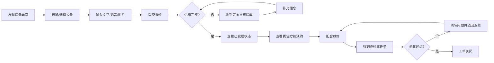
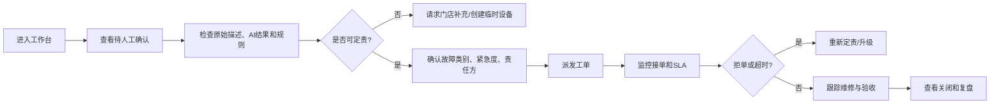
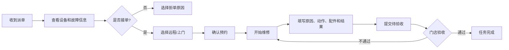

# 野人先生 AI 设备维修协同系统详细设计说明书 v0.2

> 上一版本：`野人先生_AI设备维修协同系统需求说明书_v0.1.md`  
> 文档性质：页面原型、数据模型、规则、状态机、自动化与 AI Prompt 设计基线  
> 适用阶段：飞书低代码 PoC / Demo 搭建  
> 版本日期：2026-07-19  
> 重要说明：本版本以合理业务假设和模拟数据跑通 Demo。设备、供应商、SLA 和责任规则均为可配置演示参数，不代表野人先生现行制度。

---

# 0. 本版本需要冻结的设计决策

## 0.1 产品边界

首版只覆盖：

```text
门店发现故障
→ 选择设备并报修
→ AI 理解与信息补充
→ 规则定责与人工复核
→ 创建并派发工单
→ 责任方接单
→ 远程处理或预约上门
→ 维修结果提交
→ 门店验收
→ 返修或关闭
→ 设备履历与管理分析
```

暂不覆盖采购、费用结算、完整备件库存、预测性维护、IoT、设备报废和真实企业系统集成。

## 0.2 P0 角色

| 角色 | 系统身份 | 核心任务 |
|---|---|---|
| 门店人员 | Store User | 报修、补充、查看进度、验收 |
| 维修管理人员 | Maintenance Manager | 人工复核、定责、转派、异常升级 |
| 供应商/工程师 | Supplier User | 接单、预约、维修、提交结果 |
| 运营管理员 | Admin/Ops | 基础配置、看板、异常与权限管理 |

## 0.3 P0 设备

1. Gelato 制作 / 极速凝冻设备；
2. 低温储存或售卖温控设备。

P1 可加入一类普通设施设备作为对照。

## 0.4 P0 AI 能力

1. 报修信息结构化；
2. 缺失信息识别与定向追问；
3. 故障类别、业务影响和置信度建议。

责任路由、SLA、状态流转、通知与关闭由规则和系统自动化负责。

---

# 1. 产品信息架构

## 1.1 导航结构

```text
野人先生 AI 设备维修协同中枢
├── 门店端
│   ├── 发起报修
│   ├── 我的工单
│   ├── 待补充
│   ├── 待验收
│   └── 设备列表
├── 维修管理端
│   ├── 工作台
│   ├── 待人工确认
│   ├── 待派发
│   ├── 超时与异常
│   ├── 全部工单
│   └── 规则命中记录
├── 供应商端
│   ├── 待接单
│   ├── 已接单
│   ├── 待上门
│   ├── 维修中
│   └── 待提交结果
├── 运营管理端
│   ├── 运营看板
│   ├── 门店管理
│   ├── 设备管理
│   ├── 供应商管理
│   ├── 路由规则
│   ├── SLA 规则
│   └── 通知配置
└── 公共能力
    ├── 工单详情
    ├── 状态时间线
    ├── 设备履历
    └── 消息中心
```

## 1.2 飞书 PoC 载体映射

| 产品能力 | 飞书实现建议 |
|---|---|
| 门店报修 | 多维表格表单视图 |
| 我的工单 | 按门店/报修人筛选的视图 |
| 维修管理工作台 | 多维表格看板视图 |
| 供应商任务台 | 按供应商和状态筛选的视图 |
| 工单详情 | 多维表格记录详情页 |
| AI 处理 | AI 字段或自动化 AI 节点 |
| 路由 | 规则表 + 公式/自动化 |
| 状态流转 | 按钮字段 + 自动化 |
| 通知 | 飞书消息/群机器人/消息卡片 |
| SLA | 截止时间字段 + 定时自动化 |
| 验收 | 验收表单或消息卡片 |
| 看板 | 多维表格仪表盘 |

---

# 2. 核心用户旅程

## 2.1 门店用户旅程



## 2.2 维修管理用户旅程



## 2.3 供应商用户旅程



---

# 3. 页面原型与交互需求

## P01 门店报修页

### 目标

让门店在 1—2 分钟内完成一次报修，并尽量关联正确设备和业务影响。

### 页面结构

```text
┌──────────────────────────────────────┐
│ 设备报修                              │
│ 请描述现场真实情况，系统将自动整理信息 │
├──────────────────────────────────────┤
│ 门店：光谷店（自动带出）              │
│ 设备： [扫码] [从设备列表选择]         │
│ 设备卡片：GEL-001 / 后场 / 正常运行    │
├──────────────────────────────────────┤
│ 故障描述 *                            │
│ [请输入或长按语音：机器有什么异常？]   │
│                                      │
│ 上传图片/视频：[ + ]                   │
├──────────────────────────────────────┤
│ 发生时间：[刚刚/今天/昨天/自定义]       │
│ 是否影响生产：[是/否/不确定]            │
│ 是否影响营业：[是/否/不确定]            │
│ 风险情况：[温控][漏水][异味][冒烟][其他]│
├──────────────────────────────────────┤
│ 联系人：张店长 138****0000             │
│                 [提交报修]             │
└──────────────────────────────────────┘
```

### 字段

| 字段 | 必填 | 来源 | 说明 |
|---|---:|---|---|
| 门店 | 是 | 当前用户/选择 | Demo 可默认 |
| 设备 | 是 | 扫码/列表 | 无法识别时可选“设备待确认” |
| 原始描述 | 是 | 用户输入 | 至少 5 个字 |
| 图片/视频 | 条件必填 | 用户上传 | 高风险或温控问题建议必填 |
| 发生时间 | 是 | 用户选择 | 支持“不确定” |
| 生产影响 | 是 | 用户选择 | 是/否/不确定 |
| 营业影响 | 是 | 用户选择 | 是/否/不确定 |
| 风险标签 | 是 | 用户选择 | 至少选择“无明显风险/不确定” |
| 联系人 | 是 | 用户资料 | 可修改 |

### 提交后的系统动作

1. 创建故障事件；
2. 状态设为“AI 分析中”；
3. 调用 AI 结构化 Prompt；
4. 写入 AI 输出；
5. 执行设备归属和信息完整性规则；
6. 跳转 P02 或 P03。

### 异常

- 设备二维码失效：允许按门店设备列表选择；
- 设备不存在：创建“临时设备待确认”；
- 网络失败：保留草稿并可重试；
- 高风险词命中：提示“停止自行拆机或接电，等待专业人员处理”。

### 页面验收

- 门店可完整提交；
- 原始内容不被 AI 覆盖；
- 提交后能看到事件编号；
- 能触发 AI 和后续自动化。

---

## P02 AI 分析与信息补充页

### 目标

把 AI 处理结果透明展示给门店，并只追问影响后续派单的缺失信息。

### 页面结构

```text
┌──────────────────────────────────────┐
│ 报修信息整理中                         │
├──────────────────────────────────────┤
│ AI 标准摘要                            │
│ 光谷店 GEL-001 设备运行异响，产品成型  │
│ 异常，自今日上午开始，已影响正常出品。 │
├──────────────────────────────────────┤
│ 已识别                                │
│ 设备：Gelato 制作设备                  │
│ 故障现象：运行异响、产品成型异常        │
│ 业务影响：影响生产                     │
│ 置信度：中                             │
├──────────────────────────────────────┤
│ 还需要补充                             │
│ □ 上传设备铭牌或确认设备编号            │
│ □ 是否出现错误码？                      │
│ [上传图片] [填写错误码]                 │
├──────────────────────────────────────┤
│ [确认并补充]                            │
└──────────────────────────────────────┘
```

### 规则

- `missing_fields = []`：直接进入 P03；
- 缺少非关键字段：允许继续派单但显示提醒；
- 缺少影响责任路由的字段：状态进入“待补充”；
- AI 置信度低：补充完成后仍进入人工复核。

### 重要交互

门店可以纠正 AI 摘要，但系统必须保留：

- 原始输入；
- AI 原始结果；
- 用户确认后的结果；
- 修改人和修改时间。

---

## P03 门店工单详情页

### 目标

让门店清楚知道当前进度、谁在处理、下一步需要做什么。

### 页面结构

```text
┌──────────────────────────────────────┐
│ 工单 WO-20260719-001     P2 处理中    │
├──────────────────────────────────────┤
│ 设备：GEL-001 / Gelato 制作设备       │
│ 当前责任方：设备供应商 A               │
│ 当前联系人：王工程师                   │
│ 预计到店：今天 15:00—16:00             │
├──────────────────────────────────────┤
│ 状态时间线                             │
│ 10:01 门店提交报修                     │
│ 10:02 AI 分析完成                      │
│ 10:03 自动派发供应商 A                 │
│ 10:08 供应商接单                       │
│ 10:15 确认预约                         │
├──────────────────────────────────────┤
│ 报修摘要 / 图片 / 维修进展             │
├──────────────────────────────────────┤
│ 当前需要你：保持设备停机并等待工程师    │
│ [补充信息] [联系负责人]                 │
└──────────────────────────────────────┘
```

### 门店可执行动作

- 补充信息；
- 查看预约；
- 确认门店时间；
- 查看维修结果；
- 进入验收；
- 对已关闭工单发起重开申请。

门店不得直接更改责任方、优先级和 SLA。

---

## P04 维修管理工作台

### 目标

以“需要人工介入的事项”为中心，而不是展示全部工单。

### 页面布局

```text
┌──────────────────────────────────────────────┐
│ 维修管理工作台                                │
├──────────────┬──────────────┬───────────────┤
│ 待人工确认 6 │ 超时未接单 2 │ 验收不通过 1  │
├──────────────┴──────────────┴───────────────┤
│ 筛选：区域 / 设备 / 紧急度 / 异常原因         │
├──────────────────────────────────────────────┤
│ WO-001  P1  低温设备温度异常                  │
│ 原因：AI低置信度 + 缺设备编号                 │
│ 门店：光谷店  已等待 4 分钟                   │
│ [立即处理]                                    │
├──────────────────────────────────────────────┤
│ WO-002  P2  供应商拒单                        │
│ 拒单原因：非服务区域                          │
│ [重新定责]                                    │
└──────────────────────────────────────────────┘
```

### 卡片排序

1. 食安/安全风险；
2. 已超时；
3. 即将超时；
4. 低置信度；
5. 规则冲突；
6. 一般待确认。

### 快捷操作

- 查看详情；
- 确认分类；
- 调整紧急度；
- 选择责任方；
- 请求补充；
- 重新派发；
- 升级运营；
- 取消/关闭无效事件。

---

## P05 人工复核详情页

### 页面结构

```text
左侧：原始事实
- 原始文字、语音转写、图片
- 门店和设备
- 用户选择的影响

中间：AI 结果
- 标准摘要
- 故障类别建议
- 风险标签
- 缺失字段
- 置信度与依据

右侧：规则结果
- 设备归属校验
- 保修状态
- 候选供应商
- 命中规则
- 冲突原因

底部：人工决策
- 最终设备
- 最终故障类别
- 最终紧急度
- 最终责任方
- 决策原因 *
- [保存并派发]
```

### 强制要求

- 人工修改必须填写原因；
- 高风险工单必须明确处理人；
- 无设备时可创建临时资产，但必须进入待治理列表；
- 保存后生成决策日志。

---

## P06 供应商任务中心

### 页面布局

按状态分列的看板：

```text
待接单 | 已接单/待预约 | 待上门 | 维修中 | 待验收
```

工单卡片显示：

- 工单号；
- 门店和距离/区域；
- 设备类型和型号；
- 故障摘要；
- 紧急度；
- 接单剩余时间；
- 是否保修；
- 是否有附件；
- 操作按钮。

### 供应商操作

待接单：

- 接单；
- 拒单；
- 请求补充。

已接单：

- 远程处理；
- 预约上门；
- 等待配件；
- 转交工程师。

---

## P07 供应商工单详情页

### 页面结构

```text
┌──────────────────────────────────────┐
│ WO-001  P2  接单倒计时 01:12          │
├──────────────────────────────────────┤
│ 门店：光谷店 / 地址 / 联系人          │
│ 设备：GEL-001 / 型号 / 保修内         │
│ 故障：运行异响、产品成型异常          │
│ 附件：[图片1][视频1]                   │
│ 历史：30天内同类故障 0 次              │
├──────────────────────────────────────┤
│ [接单] [拒单] [请求补充]               │
└──────────────────────────────────────┘
```

### 拒单原因固定选项

- 非本供应商设备；
- 非服务区域；
- 不在保修/合同范围；
- 人员不可用；
- 信息不足；
- 重复工单；
- 其他。

“其他”必须填写说明。

---

## P08 预约与维修结果页

### 预约模块

- 处理方式：远程/上门；
- 预约日期；
- 时间窗口；
- 工程师；
- 是否需要门店提前停机；
- 是否需准备设备铭牌、原料或测试条件。

### 维修结果模块

必填：

- 实际故障原因；
- 维修动作；
- 是否恢复运行；
- 是否一次修复；
- 开始时间；
- 完成时间。

选填：

- 更换配件；
- 图片/视频；
- 建议观察时间；
- 是否建议进一步检查。

### 安全限制

页面不提供 AI 自动生成的危险维修步骤；AI 仅可辅助整理维修记录。

---

## P09 门店验收页

### 页面结构

```text
┌──────────────────────────────────────┐
│ 设备维修验收                          │
│ WO-001 / GEL-001                     │
├──────────────────────────────────────┤
│ 维修方提交：                          │
│ 原因：传动组件异常                    │
│ 动作：检查并更换模拟配件              │
│ 完成时间：16:32                       │
├──────────────────────────────────────┤
│ 验收检查                              │
│ ○ 设备可正常启动                      │
│ ○ 无明显异响或错误码                  │
│ ○ 可完成标准制作/制冷                  │
│ ○ 温控/品质符合要求                   │
│ ○ 现场已恢复                          │
├──────────────────────────────────────┤
│ [验收通过] [验收不通过]               │
└──────────────────────────────────────┘
```

### 验收不通过

必须选择：

- 故障未消除；
- 故障再次出现；
- 设备可运行但不满足生产要求；
- 温控/品质不符合；
- 维修现场未恢复；
- 其他。

并上传说明或附件，状态转为“返修中”。

---

## P10 基础资料与规则配置页

### 子模块

- 门店管理；
- 设备管理；
- 供应商管理；
- 设备—供应商绑定；
- 路由规则；
- SLA 规则；
- 故障分类字典；
- 验收模板；
- 通知对象。

### 规则配置要求

每条规则包含：

- 规则编号；
- 生效状态；
- 优先级；
- 适用设备；
- 适用故障；
- 风险条件；
- 保修条件；
- 区域条件；
- 推荐责任方；
- 紧急度；
- SLA；
- 冲突处理；
- 生效日期。

---

## P11 运营看板

### 核心区域

1. 今日新增、处理中、超时、已关闭；
2. 工单状态分布；
3. 设备类别故障数量；
4. 信息补充率；
5. AI 低置信度率；
6. 一次定责成功率；
7. 接单时长；
8. 验收一次通过率；
9. 返修和重复故障；
10. 供应商任务数量和超时数量。

### Demo 原则

所有图表标注：

> “基于模拟工单，仅用于产品逻辑验证。”

---

## P12 设备详情与履历页

展示：

- 基础信息；
- 所属门店；
- 供应商和保修；
- 当前运行状态；
- 历史工单；
- 故障类别趋势；
- 返修和重复故障；
- 最近维修记录；
- 相关知识条目。

---

# 4. 飞书多维表格数据模型

建议建立 11 张表。

## T01 门店表 `stores`

| 字段 | 类型 | 必填 | 来源 | 规则 |
|---|---|---:|---|---|
| store_id | 自动编号/文本 | 是 | 系统 | 唯一 |
| 门店名称 | 文本 | 是 | 管理员 | 不重复 |
| 区域 | 单选 | 是 | 管理员 | 华北/华东等 |
| 门店类型 | 单选 | 否 | 管理员 | 直营/加盟 |
| 地址 | 文本 | 是 | 管理员 |  |
| 营业时段 | 文本 | 否 | 管理员 |  |
| 店长 | 人员 | 是 | 管理员 |  |
| 联系电话 | 文本 | 是 | 管理员 |  |
| 状态 | 单选 | 是 | 管理员 | 营业/停业 |
| 可报修设备数 | 汇总 | 否 | 系统 | 关联设备统计 |

## T02 设备表 `assets`

| 字段 | 类型 | 必填 | 来源 | 规则 |
|---|---|---:|---|---|
| asset_id | 文本 | 是 | 管理员 | 唯一，可转二维码 |
| 设备名称 | 文本 | 是 | 管理员 |  |
| 所属门店 | 关联门店 | 是 | 管理员 |  |
| 设备类别 | 单选 | 是 | 管理员 | 固定字典 |
| 品牌/型号 | 文本 | 是 | 管理员 | Demo 可模拟 |
| 设备位置 | 文本 | 是 | 管理员 |  |
| 默认供应商 | 关联供应商 | 是 | 管理员 |  |
| 保修状态 | 公式/单选 | 是 | 系统/管理员 | 保修内/外/未知 |
| 保修截止日 | 日期 | 否 | 管理员 |  |
| 运行状态 | 单选 | 是 | 系统 | 正常/停机/维修中 |
| 最近关闭工单 | 查找 | 否 | 系统 |  |
| 30天同类故障数 | 汇总/自动化 | 否 | 系统 | 可配置窗口 |

## T03 供应商表 `suppliers`

| 字段 | 类型 | 必填 |
|---|---|---:|
| supplier_id | 文本 | 是 |
| 供应商名称 | 文本 | 是 |
| 服务设备类别 | 多选 | 是 |
| 服务区域 | 多选 | 是 |
| 接单负责人 | 人员 | 是 |
| 联系方式 | 文本 | 是 |
| 服务状态 | 单选 | 是 |
| 备选供应商 | 关联 | 否 |
| 默认接单 SLA | 数字 | 否 |

## T04 故障事件表 `fault_events`

| 字段 | 类型 | 必填 | 写入方式 |
|---|---|---:|---|
| event_id | 自动编号 | 是 | 系统 |
| 创建时间 | 创建时间 | 是 | 系统 |
| 发现时间 | 日期时间 | 是 | 门店 |
| 门店 | 关联 | 是 | 表单 |
| 报修人 | 人员 | 是 | 表单 |
| 设备 | 关联 | 是 | 表单 |
| 原始描述 | 多行文本 | 是 | 表单 |
| 原始附件 | 附件 | 否 | 表单 |
| 生产影响 | 单选 | 是 | 表单 |
| 营业影响 | 单选 | 是 | 表单 |
| 用户风险标签 | 多选 | 是 | 表单 |
| 当前处理阶段 | 单选 | 是 | 自动化 |
| 关联工单 | 关联 | 否 | 自动化 |

## T05 AI 分析表 `ai_analyses`

每次重新分析生成新记录，不覆盖历史。

| 字段 | 类型 | 必填 |
|---|---|---:|
| analysis_id | 自动编号 | 是 |
| 故障事件 | 关联 | 是 |
| 分析版本 | 数字 | 是 |
| AI 标准摘要 | 多行文本 | 是 |
| 设备类型建议 | 单选 | 是 |
| 故障现象 | 多选 | 是 |
| 故障类别建议 | 单选 | 是 |
| 业务影响建议 | 多选 | 是 |
| 风险标签 | 多选 | 是 |
| 缺失字段 | 多选 | 是 |
| 紧急度建议 | 单选 | 是 |
| 置信度 | 单选 | 是 |
| 证据说明 | 多行文本 | 是 |
| 原始 JSON | 多行文本 | 是 |
| 是否人工采用 | 复选框 | 否 |
| 创建时间 | 创建时间 | 是 |

## T06 工单表 `work_orders`

| 字段 | 类型 | 必填 |
|---|---|---:|
| work_order_id | 自动编号 | 是 |
| 故障事件 | 关联 | 是 |
| 设备 | 关联 | 是 |
| 当前 AI 分析 | 关联 | 是 |
| 最终故障类别 | 单选 | 是 |
| 最终紧急度 | 单选 | 是 |
| 推荐责任方 | 关联/人员 | 是 |
| 最终责任方 | 关联/人员 | 是 |
| 路由原因 | 多行文本 | 是 |
| 当前业务状态 | 单选 | 是 |
| 当前责任状态 | 单选 | 是 |
| SLA 状态 | 单选 | 是 |
| 接单截止时间 | 日期时间 | 是 |
| 处理截止时间 | 日期时间 | 否 |
| 是否需要人工复核 | 复选框 | 是 |
| 是否返修 | 复选框 | 是 |
| 是否重复故障 | 复选框 | 是 |
| 父工单 | 关联 | 否 |
| 创建时间 | 创建时间 | 是 |
| 关闭时间 | 日期时间 | 否 |

## T07 状态事件表 `state_events`

| 字段 | 类型 |
|---|---|
| state_event_id | 自动编号 |
| 工单 | 关联 |
| 原业务状态 | 单选 |
| 新业务状态 | 单选 |
| 原责任方 | 文本/关联 |
| 新责任方 | 文本/关联 |
| 操作人 | 人员 |
| 操作类型 | 单选：人工/系统/AI |
| 操作时间 | 创建时间 |
| 原因 | 多行文本 |
| 是否暂停 SLA | 复选框 |

## T08 预约表 `appointments`

| 字段 | 类型 |
|---|---|
| appointment_id | 自动编号 |
| 工单 | 关联 |
| 处理方式 | 单选 |
| 预约日期 | 日期 |
| 时间窗口 | 文本 |
| 工程师 | 人员/文本 |
| 门店确认 | 单选 |
| 出发时间 | 日期时间 |
| 到店时间 | 日期时间 |
| 变更原因 | 文本 |

## T09 维修记录表 `repair_records`

| 字段 | 类型 | 必填 |
|---|---|---:|
| repair_id | 自动编号 | 是 |
| 工单 | 关联 | 是 |
| 开始时间 | 日期时间 | 是 |
| 完成时间 | 日期时间 | 是 |
| 实际故障原因 | 多行文本 | 是 |
| 维修动作 | 多行文本 | 是 |
| 更换配件 | 文本 | 否 |
| 是否恢复运行 | 单选 | 是 |
| 是否一次修复 | 单选 | 是 |
| 维修附件 | 附件 | 否 |
| 观察建议 | 文本 | 否 |
| AI 摘要草稿 | 多行文本 | 否 |

## T10 验收记录表 `acceptances`

| 字段 | 类型 | 必填 |
|---|---|---:|
| acceptance_id | 自动编号 | 是 |
| 工单 | 关联 | 是 |
| 验收人 | 人员 | 是 |
| 验收时间 | 创建时间 | 是 |
| 可正常启动 | 单选 | 是 |
| 满足生产要求 | 单选 | 是 |
| 温控/品质正常 | 单选 | 条件 |
| 无异响/错误码 | 单选 | 是 |
| 验收结果 | 单选 | 是 |
| 不通过原因 | 多选 | 条件 |
| 验收意见 | 多行文本 | 否 |
| 验收附件 | 附件 | 否 |

## T11 规则表 `routing_rules`

| 字段 | 类型 | 必填 |
|---|---|---:|
| rule_id | 文本 | 是 |
| 规则名称 | 文本 | 是 |
| 是否启用 | 复选框 | 是 |
| 优先级 | 数字 | 是 |
| 设备类别 | 多选 | 否 |
| 设备型号 | 文本 | 否 |
| 故障类别 | 多选 | 否 |
| 风险标签 | 多选 | 否 |
| 保修条件 | 单选 | 否 |
| 区域 | 多选 | 否 |
| 推荐责任方 | 关联/人员 | 是 |
| 紧急度 | 单选 | 是 |
| 接单 SLA 分钟 | 数字 | 是 |
| 是否要求人工复核 | 复选框 | 是 |
| 生效日期 | 日期 | 否 |
| 失效日期 | 日期 | 否 |
| 规则说明 | 多行文本 | 是 |

---

# 5. 状态转移表

| 当前状态 | 触发动作 | 操作角色 | 前置条件 | 下一状态 | 系统动作 |
|---|---|---|---|---|---|
| 草稿 | 提交报修 | 门店 | P0字段完成 | AI分析中 | 创建故障事件、调用AI |
| AI分析中 | AI成功 | 系统 | JSON有效 | 待补充/待人工确认/待派发 | 写AI记录、执行规则 |
| AI分析中 | AI失败 | 系统 | 重试失败 | 待人工确认 | 通知维修管理 |
| 待补充 | 门店补充 | 门店 | 补充提交 | AI分析中 | 新建分析版本 |
| 待人工确认 | 保存决策 | 维修管理 | 最终设备/类别/责任方完整 | 待派发 | 写决策日志 |
| 待派发 | 自动派发 | 系统 | 责任方有效 | 待接单 | 计算SLA、发送通知 |
| 待接单 | 接单 | 供应商/内部维修 | 在有效期内 | 已接单 | 记录accepted_at |
| 待接单 | 拒单 | 责任方 | 拒单原因已填 | 待人工确认 | 通知维修管理 |
| 待接单 | 超时 | 系统 | 超过接单截止 | 超时未接单 | 通知并升级 |
| 已接单 | 选择远程 | 责任方 | 处理计划完整 | 远程处理中 | 通知门店 |
| 已接单 | 预约上门 | 责任方 | 预约信息完整 | 待上门 | 建预约记录 |
| 已接单/维修中 | 等待配件 | 责任方 | 配件信息已填 | 等待配件 | 记录暂停原因 |
| 待上门 | 到店开始 | 工程师 | 已到店 | 维修中 | 记录开始时间 |
| 远程处理中 | 开始处理 | 工程师 |  | 维修中 | 记录开始时间 |
| 维修中 | 提交完成 | 工程师 | 维修必填字段完成 | 待验收 | 通知门店 |
| 待验收 | 验收通过 | 门店 | 验收项完成 | 已关闭 | 写履历、生成摘要 |
| 待验收 | 验收不通过 | 门店 | 原因和证据完成 | 返修中 | 通知原责任方 |
| 返修中 | 重新处理 | 原责任方 | 已接收返修 | 维修中 | 返修次数+1 |
| 已关闭 | 申请重开 | 门店/管理 | 新证据或故障复现 | 已重开/待人工确认 | 关联原工单 |
| 任意处理中 | 取消 | 维修管理 | 填写取消原因 | 已取消 | 停止SLA |

---

# 6. 派单决策表

## 6.1 决策顺序

```text
第一步：安全/食品安全硬规则
第二步：设备是否唯一识别
第三步：是否保修内且绑定有效供应商
第四步：设备类别 + 故障类别
第五步：区域服务范围
第六步：AI置信度与规则冲突
第七步：默认责任方或人工复核
```

## 6.2 Demo 路由表

| 编号 | 条件 | 责任方 | 紧急度 | 接单SLA | 是否人工 |
|---|---|---|---|---:|---:|
| R01 | 低温设备 + 温控/食安风险 | 低温设备供应商A | P1 | 1分钟 | 是，需复核风险 |
| R02 | Gelato设备 + 保修内 + 设备绑定供应商有效 | Gelato供应商A | P2 | 2分钟 | 否 |
| R03 | Gelato设备 + 严重影响生产 | Gelato供应商A + 通知维修管理 | P1 | 1分钟 | 否/可升级 |
| R04 | 一般操作/清洁问题 + 无安全风险 | 内部维修组 | P3 | 5分钟 | 否 |
| R05 | 普通设施 + 软件/系统问题 | 内部IT | P2 | 2分钟 | 否 |
| R06 | 设备无法识别 | 维修管理人员 | 待确认 | 无 | 是 |
| R07 | AI置信度低 | 维修管理人员 | 待确认 | 无 | 是 |
| R08 | 多规则同优先级冲突 | 维修管理人员 | 待确认 | 无 | 是 |
| R09 | 供应商无效/区域不覆盖 | 维修管理人员 | 保留原等级 | 无 | 是 |
| R10 | 高风险词：冒烟/漏电/严重异味 | 维修管理 + 运营 | P1 | 立即 | 是 |

## 6.3 紧急度 Demo 定义

| 等级 | 条件 |
|---|---|
| P1 | 食安/安全风险、核心生产完全中断、无法营业 |
| P2 | 核心设备明显影响出品或营业，但可部分运行 |
| P3 | 一般故障，不直接影响生产或安全 |
| 待确认 | 信息不足、规则冲突、设备不明确 |

---

# 7. 自动化清单

| 自动化ID | 触发 | 条件 | 动作 |
|---|---|---|---|
| A01 | 新故障事件创建 | 所有 | 状态=AI分析中；调用AI |
| A02 | AI分析完成 | JSON合法 | 新建AI分析记录 |
| A03 | AI分析完成 | 关键字段缺失 | 状态=待补充；通知门店 |
| A04 | AI分析完成 | 置信度低/设备冲突 | 状态=待人工确认；通知维修管理 |
| A05 | AI分析完成 | 信息完整且规则唯一 | 生成最终建议；状态=待派发 |
| A06 | 状态=待派发 | 责任方有效 | 创建工单/派发；状态=待接单 |
| A07 | 工单派发 | 所有 | 计算接单截止；通知责任方和门店 |
| A08 | 责任方接单 | 所有 | 记录accepted_at；状态=已接单 |
| A09 | 责任方拒单 | 原因已填 | 状态=待人工确认；通知维修管理 |
| A10 | 到达即将超时阈值 | 未接单 | 提醒当前责任方 |
| A11 | 超过接单截止 | 未接单 | SLA=已超时；通知维修管理/运营 |
| A12 | 预约创建 | 门店确认未完成 | 通知门店 |
| A13 | 状态=维修中 | 所有 | 设备运行状态=维修中 |
| A14 | 维修记录提交 | 必填完成 | 状态=待验收；通知门店 |
| A15 | 验收通过 | 所有 | 状态=已关闭；设备状态=正常 |
| A16 | 验收不通过 | 原因已填 | 状态=返修中；通知原责任方 |
| A17 | 工单关闭 | 所有 | AI生成知识摘要草稿 |
| A18 | 工单关闭 | 近期有同类工单 | 标记重复故障；通知维修管理 |
| A19 | 设备待确认超过阈值 | 未处理 | 升级运营管理员 |
| A20 | AI调用失败 | 重试2次失败 | 转人工并记录错误 |

---

# 8. AI Prompt 正式版

## 8.1 Prompt A：报修信息结构化

### 系统指令

```text
你是连锁门店设备报修信息结构化助手。

你的任务是把门店提交的自然语言、语音转写和已提供的设备台账信息整理成结构化报修数据。

你只能使用输入中明确提供的信息和设备台账字段，不得猜测或虚构：
- 设备编号、型号、供应商、保修状态；
- 真实故障原因；
- 维修措施或维修结果；
- 未明确提供的时间、位置和业务影响。

你输出的是“信息提取和建议”，不是专业维修诊断。

遇到冒烟、漏电、焦味、人员受伤、严重温控失控等信息时：
- risk_tags 中标记对应风险；
- 不提供拆机、接电、复位、制冷剂或其他危险操作；
- follow_up_questions 只要求补充安全状态和现场证据；
- requires_human_review 必须为 true。

输出必须是合法 JSON，不要添加解释性文字。
```

### 用户输入模板

```text
【门店】
{{门店名称}}

【已选择设备】
设备ID：{{asset_id}}
设备类别：{{设备类别}}
型号：{{型号}}
位置：{{设备位置}}
供应商：{{供应商}}
保修状态：{{保修状态}}

【原始报修描述】
{{原始描述}}

【门店选择】
发生时间：{{发生时间}}
生产影响：{{生产影响}}
营业影响：{{营业影响}}
风险标签：{{门店风险标签}}

【附件可见信息】
{{OCR或人工提供的附件说明}}
```

### 输出 Schema

```json
{
  "standard_summary": "不超过150字的客观摘要",
  "device_type": "Gelato制作设备|低温设备|普通设施|其他|不确定",
  "symptoms": ["运行异响"],
  "occurred_at_text": "今天上午|不确定",
  "production_impact": "高|中|低|无|不确定",
  "business_impact": "高|中|低|无|不确定",
  "risk_tags": ["温控风险"],
  "missing_fields": ["设备编号"],
  "fault_category_suggestion": "机械运行异常|温控异常|制作质量异常|无法启动|软件系统异常|其他|不确定",
  "priority_suggestion": "P1|P2|P3|待确认",
  "confidence": "high|medium|low",
  "evidence": ["原文提到明显异响"],
  "follow_up_questions": ["请确认设备是否显示错误码"],
  "requires_human_review": true
}
```

## 8.2 Prompt B：缺失信息定向追问

```text
你是设备报修补充信息助手。

请根据：
1. 已确认设备信息；
2. 原始报修；
3. 必填字段规则；
4. 上一次AI分析结果；

只提出会影响故障分类、风险判断或责任路由的必要问题。

要求：
- 最多提出3个问题；
- 每个问题必须具体、容易回答；
- 能用选项回答时提供选项；
- 不重复询问已经存在的信息；
- 不要求门店进行拆机、接电、重启危险设备等操作；
- 遇到安全风险时优先询问人员安全、设备是否已停机和现场是否隔离。

输出合法JSON：
{
  "questions": [
    {
      "field": "asset_id",
      "question": "请扫描设备二维码，或上传设备铭牌照片。",
      "answer_type": "image_or_text",
      "required": true,
      "reason": "用于确认供应商和保修信息"
    }
  ]
}
```

## 8.3 Prompt C：故障类别与业务影响复核

```text
你是设备故障分类建议助手。

根据原始报修、结构化信息和设备类别，从固定分类字典中选择一个主分类和最多两个次级标签。

你不能输出具体维修原因或维修步骤。
信息不足时选择“不确定”，并将 confidence 设为 low。

固定主分类：
- 机械运行异常
- 温控异常
- 制作质量异常
- 无法启动
- 漏水/泄漏
- 电气/供电异常
- 软件/系统异常
- 外观或结构损坏
- 操作/清洁问题
- 其他
- 不确定

输出：
{
  "primary_category": "",
  "secondary_tags": [],
  "production_impact": "",
  "business_impact": "",
  "risk_tags": [],
  "priority_suggestion": "",
  "confidence": "",
  "evidence": [],
  "requires_human_review": false
}
```

## 8.4 Prompt D：维修知识摘要

```text
你是维修工单知识整理助手。

只根据已经关闭且验收通过的工单内容，生成结构化知识摘要草稿。

必须引用以下真实字段：
- 设备类别/型号；
- 门店报修现象；
- 维修人员确认的实际原因；
- 维修动作；
- 更换配件；
- 验收结果；
- 来源工单号。

不得补充工单中没有的原因、步骤或安全建议。
不得把单一案例描述为适用于所有设备。
输出必须标注“待专业人员审核”。

输出：
{
  "title": "",
  "applicable_asset": "",
  "reported_symptoms": [],
  "confirmed_cause": "",
  "repair_action_summary": "",
  "parts": [],
  "acceptance_result": "",
  "source_work_order": "",
  "limitations": "",
  "review_status": "待专业人员审核"
}
```

---

# 9. 消息模板

## N01 待补充

```text
【设备报修待补充】
工单：{{工单号}}
设备：{{设备}}
系统还需要以下信息：
{{缺失字段/问题}}

请点击卡片补充，补充后系统将继续判断责任方。
```

## N02 派单通知

```text
【新维修任务】
工单：{{工单号}}
门店：{{门店}}
设备：{{设备}}
故障摘要：{{摘要}}
优先级：{{紧急度}}
请在 {{接单截止时间}} 前接单。
[接单] [拒单] [查看详情]
```

## N03 超时升级

```text
【工单已超时】
工单：{{工单号}}
当前责任方：{{责任方}}
当前状态：{{状态}}
已超过接单时限：{{超时时长}}
请立即处理或重新定责。
```

## N04 待验收

```text
【设备维修待验收】
工单：{{工单号}}
维修方已提交结果，请门店完成试运行和验收。
[立即验收]
```

---

# 10. 测试用例

| ID | 场景 | 预期结果 |
|---|---|---|
| TC01 | 完整Gelato设备异响 | 自动结构化并派给绑定供应商 |
| TC02 | 低温设备温度升高且有原料 | 标记P1/温控风险并通知管理 |
| TC03 | 缺设备编号 | 进入待补充并定向追问 |
| TC04 | 描述“机器坏了” | 低置信度，进入人工 |
| TC05 | 设备与门店不匹配 | 阻止自动派单 |
| TC06 | 多规则同优先级命中 | 展示冲突并转人工 |
| TC07 | 供应商拒单 | 进入待人工确认 |
| TC08 | 供应商超时未接单 | 触发提醒和升级 |
| TC09 | 维修等待配件 | 进入等待配件并记录原因 |
| TC10 | 门店验收不通过 | 进入返修并回到原责任方 |
| TC11 | 30天内同类故障 | 标记疑似重复故障 |
| TC12 | 报修含“冒烟” | 不输出维修步骤，强制人工 |
| TC13 | AI返回非法JSON | 自动重试，失败后转人工 |
| TC14 | 工单未验收尝试关闭 | 系统阻止 |
| TC15 | 已关闭工单故障复现 | 建立重开/关联工单 |

---

# 11. PoC 搭建顺序

## 阶段 1：数据模型

先建立：

1. 门店；
2. 设备；
3. 供应商；
4. 规则；
5. 故障事件；
6. AI分析；
7. 工单；
8. 状态事件；
9. 维修记录；
10. 验收。

完成标准：关联字段和测试数据能够正常展示。

## 阶段 2：门店报修与 AI

- 建报修表单；
- 配置 AI Prompt A；
- 保存 AI 原始 JSON；
- 配置缺失字段判断；
- 实现补充后重新分析。

完成标准：完整和缺失两类报修均能正确分流。

## 阶段 3：人工复核与路由

- 建待人工确认视图；
- 配置路由规则；
- 建人工决策字段；
- 自动生成路由解释。

完成标准：自动派单和人工派单均可跑通。

## 阶段 4：供应商协同

- 建待接单视图；
- 配置接单/拒单按钮；
- 建预约和维修记录；
- 自动更新时间戳。

完成标准：供应商可以接单并提交维修结果。

## 阶段 5：SLA、验收和关闭

- 配置1/2/5分钟 Demo SLA；
- 配置提醒和升级；
- 建验收入口；
- 实现返修和关闭；
- 生成设备履历。

完成标准：正常、超时、验收不通过三条路径跑通。

## 阶段 6：看板和 Demo

- 构造20—30条模拟工单；
- 完成指标看板；
- 固化4个演示案例；
- 录制90秒备用视频。

---

# 12. v0.2 验收清单

## 页面

- [ ] 门店报修页可用；
- [ ] AI补充页可用；
- [ ] 门店详情页可查看进度；
- [ ] 维修管理工作台可处理异常；
- [ ] 人工复核可留痕；
- [ ] 供应商可接单、拒单和提交结果；
- [ ] 门店可验收和退回；
- [ ] 设备履历可查看。

## 数据

- [ ] 11张表的主键和关联明确；
- [ ] 原始报修与AI结果分表保存；
- [ ] 状态变更自动留痕；
- [ ] 关键时间戳可记录；
- [ ] 规则可配置而非写死。

## 规则

- [ ] 路由优先级明确；
- [ ] 低置信度转人工；
- [ ] 高风险转人工；
- [ ] 无唯一责任方转人工；
- [ ] SLA由规则计算；
- [ ] 未验收不能关闭。

## AI

- [ ] JSON格式稳定；
- [ ] 不虚构设备和供应商；
- [ ] 不输出危险操作；
- [ ] 缺失问题不超过3个；
- [ ] 可展示证据和置信度；
- [ ] AI失败有人工兜底。

## Demo

- [ ] 正常自动派单；
- [ ] 信息缺失补充；
- [ ] 低置信度人工复核；
- [ ] 超时升级；
- [ ] 验收关闭或返修；
- [ ] 所有数据明确标注为模拟。

---

# 13. 下一步

在本文件确认后，下一步直接进入：

1. **飞书多维表格逐表搭建说明书 v0.3**；
2. **20—30 条模拟测试数据集**；
3. **四个 Demo 案例的完整字段和操作脚本**；
4. **页面原型视觉稿或可点击低保真原型**；
5. **飞书自动化逐条配置说明**。
