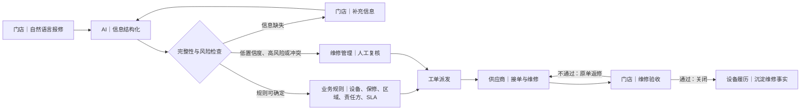
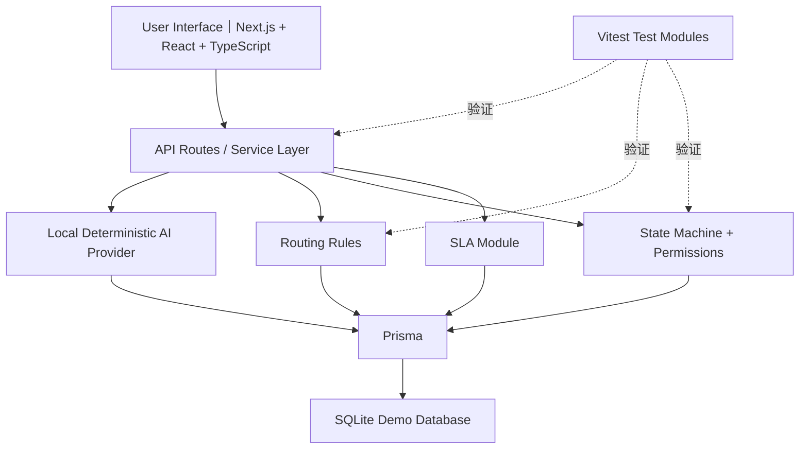

# 野人先生 AI 设备维修协同中枢

**面向连锁门店设备维修协同场景的 AI 产品 PoC / 全栈业务原型。**

本项目验证从门店自然语言报修、AI 信息结构化、确定性规则路由、人工复核、供应商处理，到门店验收和设备维修履历沉淀的完整业务闭环。

[Live Demo](https://yeren-repair-optimization-platform.vercel.app) · [Demo Guide](./DEMO_SCRIPT.md) · [Case Study](./docs/PORTFOLIO_CASE_STUDY.md) · [Source Code](https://github.com/echoehco79-cpu/yeren-repair-optimization-platform)

> **模拟数据声明：** 本项目为独立产品研究与全栈原型。所有门店、设备、供应商、SLA、联系方式、维修案例和运营指标均为 Demo 模拟数据，不代表野人先生真实内部流程、制度或运营情况；项目并非企业官方系统，也未接入企业生产数据。

**我的角色：** 我负责产品研究、问题定义、流程与状态机设计、AI／规则／人工边界、演示场景和验收标准，并使用 Codex 辅助完成全栈原型开发、调试与迭代；我对业务逻辑、生成结果、测试和最终验收负责。

**English summary:** *An AI-assisted maintenance collaboration PoC for multi-store retail operations, covering unstructured fault reporting, information extraction, deterministic routing, human review, supplier execution, store acceptance, SLA escalation, and asset maintenance history. All business data is simulated for demonstration and feasibility validation.*

## Product Preview

### 门店报修与完整性检查


门店以自然语言描述故障，系统保留原始事实，并在进入正式工单前检查关键信息是否完整。

<table>
  <tr>
    <td width="50%">
      
      <br /><strong>AI 分析与规则路由</strong><br />结构化建议、置信度和规则命中结果分层展示。
    </td>
    <td width="50%">
      
      <br /><strong>维修管理人工复核</strong><br />低置信度、高风险和冲突情况保留人工决策权。
    </td>
  </tr>
  <tr>
    <td width="50%">
      
      <br /><strong>供应商任务处理</strong><br />供应商在权限和状态机约束下接单、维修并提交结果。
    </td>
    <td width="50%">
      
      <br /><strong>SLA 异常升级</strong><br />演示即将超时、已经超时、人工介入和重新派发。
    </td>
  </tr>
  <tr>
    <td width="50%">
      
      <br /><strong>门店验收</strong><br />维修结果必须经过门店确认；不通过则进入原工单返修。
    </td>
    <td width="50%">
      
      <br /><strong>设备维修履历</strong><br />将报修事实、处理过程、验收结果沉淀到设备维度。
    </td>
  </tr>
</table>

### 运营视角


运营看板用于观察 Demo 工单结构、状态与 SLA 风险，不代表真实企业经营指标。

## Project Overview

- **项目背景：** 连锁门店设备维修协同通常涉及门店、维修管理、供应商和运营等多个角色。本项目以这一通用场景为研究对象，不假设已经掌握某家企业的真实内部流程。
- **项目目标：** 验证非结构化报修信息如何转化为可流转、可追踪、可验收的工单，并在自动化效率与业务责任之间建立清晰边界。
- **项目类型：** 独立产品研究、业务流程设计与全栈 PoC。
- **数据性质：** 全部业务主数据、案例、联系方式和指标均为模拟数据。
- **当前阶段：** 用于产品逻辑、业务闭环和技术可行性验证，不是生产系统；关键假设仍需通过企业访谈和真实数据进一步确认。

## The Problem

本 PoC 聚焦并验证以下通用业务问题，它们是产品研究假设，不代表野人先生的真实内部现状已经得到确认：

- 门店使用自然语言描述现场故障时，信息可能难以直接形成标准工单；
- 设备匹配、保修判断、紧急等级、责任方和 SLA 需要通过明确且可解释的规则判断；
- 低置信度、高风险和特殊情况不适合完全自动化，需要人工复核；
- 门店、维修管理与供应商需要围绕同一工单共享事实和处理进度；
- 超时、拒单、改派和返修需要受到合法状态流转与角色权限约束；
- 维修完成后需要门店验收，并把处理事实沉淀为设备维修履历。

## Solution

原型以“原始事实不被覆盖、自动化结果可解释、最终责任由人承担”为原则，将 AI 信息提取、确定性业务规则、人工复核、工单状态机和 SLA 异常处理组合成一条可演示的端到端闭环。AI 帮助整理信息，不承担专业诊断和最终责任；规则负责可解释判断；人工处理低置信度、高风险和规则冲突。

## Core Workflow



## Key Product Decisions

### 1. AI、规则和人工分工

- AI 负责从非结构化报修描述中提取、归纳和总结信息，输出辅助建议，而不是最终专业维修结论；
- 确定性规则负责设备、保修、区域、责任方和 SLA 等可解释判断；
- 低置信度、高风险或规则冲突进入人工复核，最终业务决定和责任由人工承担；
- AI 不自由选择供应商、不关闭工单，也不输出危险维修操作。

### 2. 原始事实与分析结果分离

- 门店原始描述永久保留，AI 分析不会覆盖原始报修内容；
- AI 分析版本可追溯，规则命中结果独立展示；
- 人工修改、最终结论和关键动作写入工单时间线。

### 3. 状态机和权限

- 信息未补充完整前不能提前进入正式工单；
- 只有“待接单”可以接单，只有“处理中”可以提交维修结果，未经验收不能关闭；
- 验收不通过进入原工单返修，保留上下文与责任链；
- 供应商只能处理属于当前责任方的工单；取消、改派和人工定责受到角色权限限制。

### 4. SLA 和异常处理

- Demo 支持 P1／P2／P3 模拟 SLA，以及即将超时、已经超时、通知、人工复核和重新派发；
- 当前超时机制是原型实现。生产环境仍需要后台调度器、幂等任务、可靠事件记录和真实通知渠道。

## My Role and Contribution

我主导了业务背景与公开资料研究，建立证据分级，并区分事实、推断、行业参照和待验证内容；在此基础上完成 As-Is 假设、To-Be 流程、PoC 范围、四角色协同、状态机、权限和异常路径设计。我也定义了 AI／规则／人工责任边界、页面信息架构、演示场景、产品验收标准与测试用例。

在实现阶段，我使用 Codex 作为 AI 开发助手完成全栈原型开发、调试和迭代，同时保留对需求、业务逻辑、生成结果审查、测试、修复和最终验收的责任。该项目不代表我参与过野人先生企业内部项目，也不声称所有代码均由我手工独立编写。

**English:** I led the product research, problem framing, workflow design, state-machine definition, AI/rule/human decision boundaries, demo scenario design, and product acceptance criteria. I used Codex as an AI development assistant to implement and iterate the full-stack prototype, while retaining responsibility for requirements, business logic, review, testing, and final validation.

## Demo Scenarios

| 场景 | 场景目的 | 关键角色 | 验证的产品机制 |
| --- | --- | --- | --- |
| 正常自动派单 | 验证信息完整且规则唯一时的主流程 | 门店、系统、供应商 | AI 结构化、确定性路由、接单与维修 |
| 信息缺失后补充 | 防止不完整信息提前转为正式工单 | 门店、系统 | 完整性检查、补充信息、重新分析 |
| AI 低置信度复核 | 验证自动化边界与责任保留 | 门店、维修管理 | 置信度阈值、人工定责、审计时间线 |
| P1 超时与改派 | 验证异常不会绕过权限和状态机 | 维修管理、供应商、运营 | SLA 预警、升级、人工复核、重新派发 |
| 验收不通过返修 | 验证闭环质量与上下文连续性 | 门店、供应商 | 门店验收、原工单返修、再次处理 |

完整演示步骤请参见 [DEMO_SCRIPT.md](./DEMO_SCRIPT.md)。

## Validation and Quality

以下结果均可在仓库脚本与验收文档中核验，代表原型质量验证，不代表实际业务效果：

- ESLint 检查通过；
- TypeScript typecheck 通过；
- 3 个测试文件、26／26 个自动化测试通过；
- Next.js production build 通过；
- 12／12 张桌面端与移动端截图成功生成；
- 5 条端到端产品场景完成真实页面操作验收；
- 390 × 844 移动端关键页面完成视觉 QA。

详细结果参见 [Product Acceptance Report](./PRODUCT_ACCEPTANCE_REPORT.md)、[Manual Test Results](./MANUAL_TEST_RESULTS.md) 与 [UI Review](./UI_REVIEW.md)。

## Technical Architecture

项目采用单体全栈原型架构：Next.js 与 React 构建界面，TypeScript 贯穿应用层，API Routes 与服务层组织业务能力；本地确定性 AI Provider、路由规则、状态机和 SLA 模块共同处理工单逻辑，通过 Prisma 访问 SQLite Demo 数据库。Vitest 覆盖关键规则与状态流转。



## Current Limitations

- 无真实用户认证、组织权限体系和租户隔离；
- 无真实企业门店、设备、供应商或保修主数据接入；
- 无真实飞书、短信、邮件或其他通知渠道；
- AI 使用本地确定性 Provider，不是生产级模型服务或专业故障诊断系统；
- SQLite 与 Vercel 临时运行环境仅用于 Demo，不适合持久化生产数据；
- SLA 检查不是生产级后台调度，缺少幂等任务、重试和告警保障；
- 无真实附件上传、病毒扫描和对象存储；
- 未覆盖采购、维修费用、备件库存、IoT、预测性维护和设备报废；
- 所有业务数据均为模拟数据，业务假设需要通过企业访谈与真实数据验证。

完整限制参见 [KNOWN_LIMITATIONS.md](./KNOWN_LIMITATIONS.md)。

## Run Locally

### 安装与启动

```bash
npm install
cp .env.example .env
npm run demo:setup
npm run dev
```

打开 [http://localhost:3000](http://localhost:3000)。本地 Demo 数据可以通过 `npm run demo:setup` 重新生成。

### 质量检查

```bash
npm run lint
npm run typecheck
npm test
npm run build
```

### 生成产品截图

```bash
npm run screenshots
```

脚本生成的完整测试截图保存在本地 `screenshots/`；作品集筛选图单独维护在 `docs/images/`，避免把全部测试产物提交到仓库。

## Documentation

- [Portfolio Case Study](./docs/PORTFOLIO_CASE_STUDY.md) — 面向招聘人员与面试官的项目案例
- [Demo Script](./DEMO_SCRIPT.md) — 五条核心场景的完整演示步骤
- [Product Acceptance Report](./PRODUCT_ACCEPTANCE_REPORT.md) — 产品验收结论与证据
- [Build Status](./BUILD_STATUS.md) — 构建、测试与截图状态
- [Known Limitations](./KNOWN_LIMITATIONS.md) — 已知限制与生产化差距
- [Implementation Plan](./IMPLEMENTATION_PLAN.md) — 原型实施范围与阶段记录
- [Manual Test Results](./MANUAL_TEST_RESULTS.md) — 手工场景验收结果
- [UI Review](./UI_REVIEW.md) — 桌面端与移动端视觉检查
- [Assumptions and Conflicts](./docs/ASSUMPTIONS_AND_CONFLICTS.md) — 假设、证据和冲突处理
- [Feishu Mapping](./docs/FEISHU_MAPPING.md) — Demo 字段与协同平台映射设想

---

本仓库用于作品集展示、产品讨论与技术可行性验证。任何生产化判断，都应在完成企业访谈、数据合规评估、安全设计和真实环境验证后再作出。
